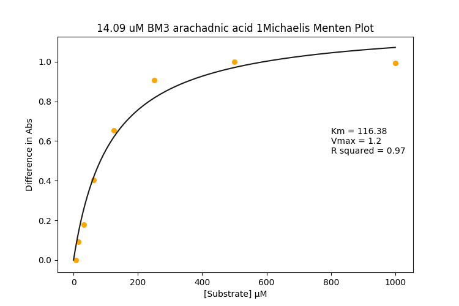

## James's P450 Binding Assay
### 384 Well plate sytle
### Overveiw:
Emulates old-school titrations that are used to work out how tightly a given compound binds in the acive site of P450 enzymes. In this assay no energy is consumed and no chemical reaction (should) happen, it works because P450 enzymes change the UV-Visible light absorbance profile as they bind to compounds. Here's an example:

|Raw Spectra|Difference Spectra|Michaelis-Menten Plot|
|---|---|---|
||||

The **Raw Spectra** is the P450's change in UV-Visible light absorbance due to the compound binding in the active site and doing some --chemistry??

The **Difference Spectra** is the raw spectra that have had the 0 substrate concentration race subtracted from them. This is used to calculate the:

**Michaelis Menten** plot. Compound concentration is plotted against the (peak height at ~ 420 nm - peak depth at ~390 nm), which sort of quantifies the state change of the P450 in response to addition of the compound. From this you can fit a curve to the data according to the equation ```y = (vmax*x)/(km + x)``` where km is the term I'm really interested in.

#### Complications
Some compounds have their own absorbance in the UV-Vis range, which messes up the measurements. To deal with this I do a protein-free replicate of each test well and subtract the absorbance trace of that from its counterpart. This works but it doubles the ammount of compound needed.

#### Consumables:
* Clear bottom 384 well plate (I've been getting better results with various treated plates but haven't done a proper comparison yet)
* A mother plate of your choice! I sometimes use deep well plates, sometimmes PCR strips, whatever's around and is SBS (96 well) format.
* Buffer: I use 100 mM potassium phosphate buffer at pH 7 for P450 BM3, apparently it's happy in that, though it might be slightly different in a plate well.
* P450 Heme domain - I've been shooting for about 5-15 uM, which is was giving me a clean signal on a BMG Pherastar FS.
* Your compounds in DMSO (I do mine at 10 mM)

#### Equipment
* Plate reader - duh. I've been using one that does a spectral trace from 220 to 800 nm for each well because it's most similar to the traditional methods. I use the BMG PheraStarFS over the numerous BMG Clariostars because they're about 4 times as fast.
* Centrifuge that can spin your plates
* Multichannel pipette - I use one that can do the 10-50 ul range for the plate itself and a 200 ul one for making up the mother plate.

#### Procedure

* **Serial dultion of compounds**  in master plate.
  * Allow 25 ul for each well (2 per compound) and make up 8% v/v (compound in DMSO):Buffer
  * Serial Dilution (1/2) along short axis

* **Transfer 25 ul of Compound dilutions to assay plate** Like this:

|||
|----|------|
|Serial dilutions are done on the short axis in the mother plate on the left, and 25 ul is transferred  to each target well in the assay plate on the right. 2 target wells for each compound (test and control) one above the other.||

Each compound concentration gets one test well and one control well. One compound for each columns * number of repeats.

* **Add 25 ul of diluted enzyme to the test wells** marked by red in the pic above.

* **Add 25 ul of the buffer to the control wells** marked by green.

* **Mix** by pipetting or shaking. I do shaking to save tips but I haven't*  tested for the best way yet.

* **Read absorbance** from 220-800 nm or something like that. I chose these because it's the closest I can get to traditional style titrations.

**Analyse**
