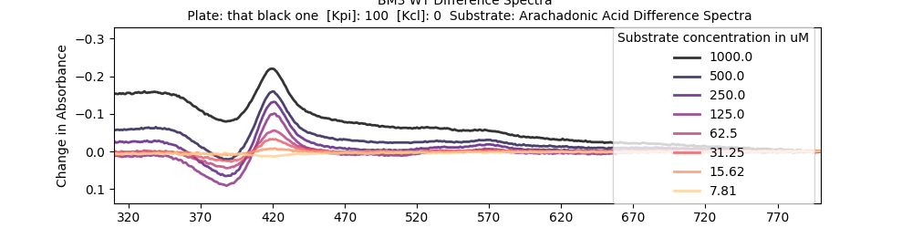
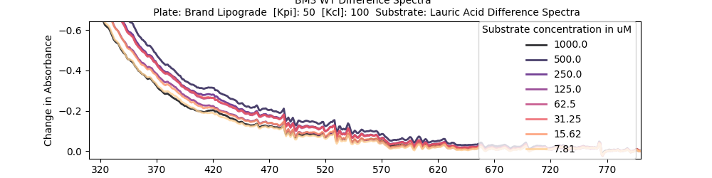
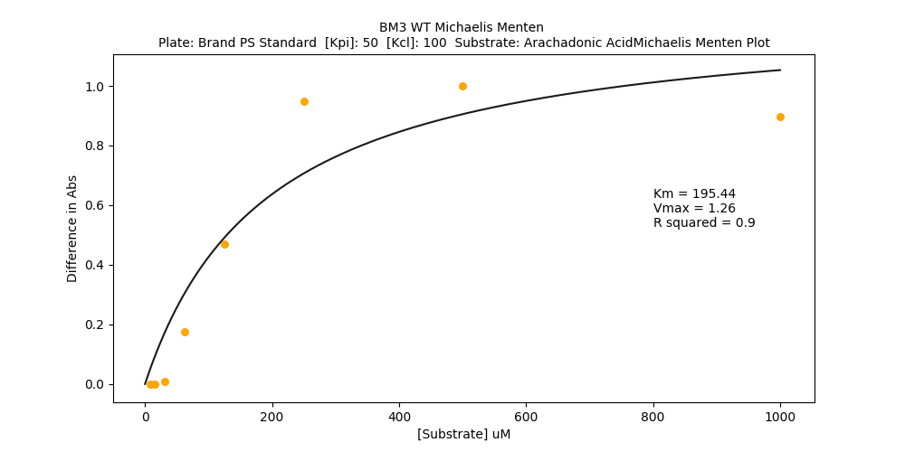
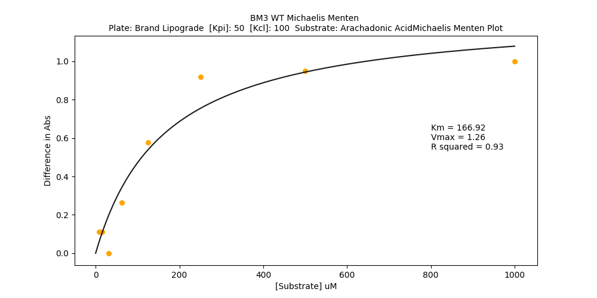
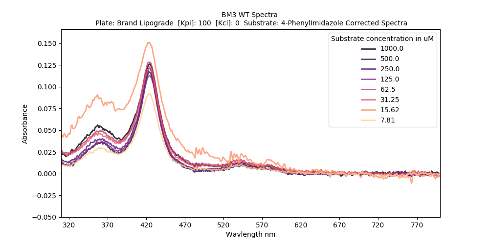

### Validation tests
### Background
I've been developing a plate-based analog of traditional P450 titrations. I think I'm mostly there but have a few last questions to answer and also want to put this experiment to bed with a  big test to end all tests.

**Loose ends:**
*   **Which plate type is best??** I have a lot of diffent plate types that I was sent by various suppliers. Ideally, I can get this thing working well in the cheapest plate type.
* **How sensitive can I make it??** At the moment, I'm having trouble picking up a signal from palmitic acid, which might be to do with plate type, or maybe it can be helped by tinkering with the buffer. We'll see here.

I'm aiming to do this experiment with a fluid handling robot to save the experiment from the walking accident waiting to happen that is me. I'll do this with wild type P450 BM3 heme domain. For my substrates I'm using the usual suspects:
* **Arachadionic acid** - Natural substrate, This has been giving me a good signal so far and doesn't normally have dramas.
* **Lauric acid** -  but gives a weaker signal than Arachadionic acid
* **Plamitic acid** - this one is a tricky one. It gives a substrate shift in titration experiments, but a weak one, which I haven't been abe to pick up in my plate assays so far. It would be good to have the assay sensitive enough to detect binders of substrates like this.
* **4-Phenylimidazole** - Inhibitor, should give a different type of shift, which I'll have to write something to accomodate for this. Also give a fairly weak signal.
********
### The Plan

Here are the plates I have and want to test:

|Make|Plate type| Product Number|Qty |
|:---:|:--------:|:-------------:|:---:|
|Thermo|Nunclon Delta Surface|? |20 |
|Brand|?|781620|2|
|Brand|Lipograde| 781860|4|
|Nunc| Maxisorp| 464718|1|
|Corning| Cellbind| 3770BC| 17|
|Corning| Cellbind| 3640|14|

##### Buffers
I also want to test some buffer conditions, but not too many. The current buffer I'm working with is 100 mM Kpi @ pH7, which apparently is where BM3 is happy on a normal day. Things are a bit different in a plate because of the contact area. I'll dig up some literature or something but Hazel recommended me some ranges to work in:

|Buffer component|Low/mM|Mid/mM|High/mM|
|-------------|---------|-----|----|
|KPi|50|100|150|
|KCl|0|100|200|

I want to do a combinatoria design with these ones, and I also wanted the midpoint to check for nonlinearities because I was interested.
I'll do it like this:
```python
Out[12]:
   KPi  KCl
0   50    0
1   50  200
2  100  100
3  150    0
4  150  200
```
Here's another way of looking at it:


##### Layouts
* **4 substrates**  times **5 Buffer conditons** plus a column for zeroing the whole thing. That's 21/24, so I'll use the last 3 columns for repeats of the center point.

```python
In [2]: pd.read_csv('PlateLayout1.csv')
Out[2]:
    Column          Substrate  Kpi /MM  Kcl/mM
0        1               DMSO      100       0
1        2  Arachadionic Acid       50       0
2        3  Arachadionic Acid       50     200
3        4  Arachadionic Acid      100     100
4        5  Arachadionic Acid      100     100
5        6  Arachadionic Acid      150       0
6        7  Arachadionic Acid      150     200
7        8        Lauric Acid       50       0
8        9        Lauric Acid       50     200
9       10        Lauric Acid      100     100
10      11        Lauric Acid      100     100
11      12        Lauric Acid      150       0
12      13        Lauric Acid      150     200
13      14      Palmitic Acid       50       0
14      15      Palmitic Acid       50     200
15      16      Palmitic Acid      100     100
16      17      Palmitic Acid      100     100
17      18      Palmitic Acid      150       0
18      19      Palmitic Acid      150     200
19      20  4-Phenylimidazole       50       0
20      21  4-Phenylimidazole       50     200
21      22  4-Phenylimidazole      100     100
22      23  4-Phenylimidazole      150       0
23      24  4-Phenylimidazole      150     200
```
Each compound has each of 5 buffer conditions per plate plus a repeat of the 100:100 center point, except for 4-Phenylimidazole because I ran out of space. 🤷

I think I'll make a single master plate by hand and pipette that into the 6 or so plates by robot. I'll try to get my hands on a few more 384 well plates from the building, I'd really like to find the cheapest viable option.
**************
#### Master plate calculations

```python
In [8]: nplates = 6
In [9]: vol_of_each_compound_conc = nplates *6*2*25 # 6 reps/plate for everything except 4phenylimidazole, 2 wells/col,25ul/well
In [4]: masterplate = np.zeros((8,12)) #96 wells
In [12]: masterplate[:,:5]+=1*(vol_of_each_compound_conc+100) #plus a bit of dead volume
In [13]: masterplate
Out[13]:
array([[1900., 1900., 1900., 1900., 1900.,    0.,    0.,    0.,    0.,
           0.,    0.,    0.],
       [1900., 1900., 1900., 1900., 1900.,    0.,    0.,    0.,    0.,
           0.,    0.,    0.],
       [1900., 1900., 1900., 1900., 1900.,    0.,    0.,    0.,    0.,
           0.,    0.,    0.],
       [1900., 1900., 1900., 1900., 1900.,    0.,    0.,    0.,    0.,
           0.,    0.,    0.],
       [1900., 1900., 1900., 1900., 1900.,    0.,    0.,    0.,    0.,
           0.,    0.,    0.],
       [1900., 1900., 1900., 1900., 1900.,    0.,    0.,    0.,    0.,
           0.,    0.,    0.],
       [1900., 1900., 1900., 1900., 1900.,    0.,    0.,    0.,    0.,
           0.,    0.,    0.],
       [1900., 1900., 1900., 1900., 1900.,    0.,    0.,    0.,    0.,
           0.,    0.,    0.]])
# I don't think this will work, the deepest plate I know about does 2000 µM, but the wells will have to accomodate double that, so I'm spreading each compound across two master plate columns.
In [14]: masterplate = np.zeros((8,12))
In [15]: masterplate[:,:9]+=1*((vol_of_each_compound_conc)/2+100)
In [16]: masterplate
Out[16]:
array([[1000., 1000., 1000., 1000., 1000., 1000., 1000., 1000., 1000.,
           0.,    0.,    0.],
       [1000., 1000., 1000., 1000., 1000., 1000., 1000., 1000., 1000.,
           0.,    0.,    0.],
       [1000., 1000., 1000., 1000., 1000., 1000., 1000., 1000., 1000.,
           0.,    0.,    0.],
       [1000., 1000., 1000., 1000., 1000., 1000., 1000., 1000., 1000.,
           0.,    0.,    0.],
       [1000., 1000., 1000., 1000., 1000., 1000., 1000., 1000., 1000.,
           0.,    0.,    0.],
       [1000., 1000., 1000., 1000., 1000., 1000., 1000., 1000., 1000.,
           0.,    0.,    0.],
       [1000., 1000., 1000., 1000., 1000., 1000., 1000., 1000., 1000.,
           0.,    0.,    0.],
       [1000., 1000., 1000., 1000., 1000., 1000., 1000., 1000., 1000.,
           0.,    0.,    0.]])
# Looks fine, by the end, the plate should be loke this:
In [17]: masterplate[-1,:9]+=1000 # last row ends up double volume
In [20]: masterplate_df = pd.DataFrame(masterplate,columns = ['DMSO','Arachadionic      Acid','Arachadionic Acid',\
    ...: 'Lauric Acid','Lauric Acid','Palmitic Acid','Palmitic Acid','4-Phenylimidazole','4-Phenylimidazole','Empty','Empty','Empty'])
In [23]: masterplate_df.to_csv('masterplate_df.csv')
```
[masterplate_df.csv](masterplate_df.csv)

Cool, that should do it.

********
#### Buffer pipetting calculations
I might as well do this now
```python
In [45]: bufferconcs = pd.read_csv('PlateLayout1.csv')

In [46]: bufferconcs=bufferconcs.groupby(['Kpi /MM','Kcl/mM']).size().reset_index().rename(columns={0:'count'})\
...: print(bufferconcs)
Out[46]:
   Kpi /MM  Kcl/mM  count
0       50       0      4
1       50     200      4
2      100       0      1
3      100     100      7
4      150       0      4
5      150     200      4


In [50]: bufferconcs['count']*=(6+25+8) # 6 reps * 8 wells per col with protein in * 25 ul\
    ...: print(bufferconcs) # I cheated and renamed the col by hand
    ...:
   Kpi /MM  Kcl/mM  Vol Prot/µl
0       50       0   6084
1       50     200   6084
2      100       0   1521
3      100     100  10647
4      150       0   6084
5      150     200   6084

In [55]: bufferconcs.columns=['Kpi /MM',  'Kcl/mM',  'Volume/ul']
In [56]: bufferconcs['Volume/ul']+=500 # seem like a reasonable safety margin?

In [57]: bufferconcs
Out[57]:
   Kpi /MM  Kcl/mM  Volume/ul
0       50       0       6584
1       50     200       6584
2      100       0       2021
3      100     100      11147
4      150       0       6584
5      150     200       6584
```
One issue will be ensuring that the enzyme concentration is more or less the same across all the samples. I'll just have to pipette really carefully. And do maths properly.

***********

### Robot Stuff
The plan is to adapt [this sheet](Example_Transfer_form.csv) to fit my experimental setup.

```python
In [33]: import pandas as pd

In [34]: data = pd.read_csv('Example_Transfer_form.csv')

In [35]: data
Out[35]:
    Volume SourcePlateBarcode SourcePlateWell DestinationPlateBarcode DestinationPlateWell     ComponentName
0       48    MastermixTrough              A1           190424PCRLCR3                   A1                mm
1       48    MastermixTrough              B1           190424PCRLCR3                   B1                mm
2       48    MastermixTrough              C1           190424PCRLCR3                   C1                mm
3       48    MastermixTrough              E1           190424PCRLCR3                   E1                mm
4       48    MastermixTrough              F1           190424PCRLCR3                   F1                mm
```
Looks simple enough, I'm assuming that to multichannel I just reference the cell that heads the column. I'll use some sort of variable name instead barcodes for now.

```python
In [1]: import pandas as pd

In [2]: assayPlate = pd.read_csv('PlateLayout1.csv')

In [3]: ExampleSheet = pd.read_csv('Example_Transfer_form.csv')

In [4]: masterplate = pd.read_csv('masterplate_df.csv')
# Lot of different formats, whoops
In [7]: Letters = ['A','B','C','D','E','F','G','H','I','J','K','L','M','N','O','P']
# Got to start indexin these plates properly
# I might just write a proper script
```

*********
### Prep
I've decided to use this [transfer sheet](DraftTransferForm.ods) that I wrote manually. From the mastertrof, lane D is used most (7x), so per run I'll be using
```python
In [1]: 7*25*8
Out[1]: 1400
In [2]: 1400*6 #6 plates
Out[2]: 8400

```
8400µM of lane D. I'll check that the trof can hold That. For the ligands I'll be using:
```python
In [4]: 6*2*25 #6cols per cpd * 2 wells pr conc * 25 ul perwell
Out[4]: 300
In [5]: 6*300 #6 plate types
Out[5]: 1800
```
1800µl for serial dilutions sounds a bit much, so I'll just duplicate the wells and make a second sheet. 3 and 3 should do it. Here's how the compound plate columns will look:

|Column|Compound|
|------|---------|
|1|DMSO|
|2|Arachadonic acid|
|3|Lauric Acid|
|4|Palmitic Acid|
|5|4-Phenylimidazole|
|6|DMSO|
|7|Arachadonic acid|
|8|Lauric Acid|
|9|Palmitic Acid|
|10|4-Phenylimidazole|
|11|-|
|12|-|

********
### 17th July - Test Day

#### Lab notes
1. Make compount plates
  * 8% DMSO in 2000µl buffer (100mM KPi)

```python
In [1]: import pandas as pd

In [2]: def mass_required(mw):
   ...:    ...:     return mw * 0.1 * 0.001 # 0.1 M and 1 ml
   ...:

In [3]: arachadonic = mass_required(304.47)

In [4]: lauric = mass_required(200.32)

In [5]: palmitic = mass_required(278.41)

In [6]: print('arachadonic: ',arachadonic,'lauric: ',lauric,'palmitic: ',palmitic)
   ...: ('arachadonic: ', 0.030447000000000002, 'lauric: ', 0.020032, 'palmitic: ', 0.025642000000000005)
   ...:
('arachadonic: ', 0.030447000000000002, 'lauric: ', 0.020032, 'palmitic: ', 0.027841000000000005)
Out[6]:
('arachadonic: ',
 0.030447000000000002,
 'lauric: ',
 0.020032,
 'palmitic: ',
 0.025642000000000005)

In [7]:  data=pd.DataFrame([[arachadonic,lauric,palmitic],[0.0311,0.0205,0.0168]],index=['Target Weight','Actual Weight']).transpose()

In [8]: data['Vol required/ml']=data['Actual Weight']/data['Target Weight']

In [9]:  data=pd.DataFrame([[arachadonic,lauric,palmitic],[0.0311,0.0205,0.0186]],index=['Target Weight','Actual Weight']).transpose()

In [10]: data['Vol required/ml']=data['Actual Weight']/data['Target Weight']

In [11]: data
Out[11]:
   Target Weight  Actual Weight  Vol required/ml
0       0.030447         0.0311         1.021447
1       0.020032         0.0205         1.023363
2       0.027841         0.0186         0.668079

```
The palmitic acid wouldn't dissolve easily at that conc so I doubled up the DMSO volume for now.


Here's some buffer caluclations - I'm doubling the KCl concs and for the KPi concs I've got this:
```python
In [17]: startingKPiConc(50.)
Out[17]: 0.0

In [18]: startingKPiConc(100.)
Out[18]: 100.0

In [19]: startingKPiConc(150.)
Out[19]: 200.0
```

#### Change of plan!
Ended up pushing the experiment back until Monday because I prioritised doing it on a robot over doing it soon. I met with Mark and we went through my sheet. It turns out that the channels are individually controlled and the sheet I had before would only do the columns. I made a [script](TransferSheetFix.py) to handle this, which gave [this transfer sheet](DraftTransferForm2.csv)

**********
20190729

Did a wet run of my transfer sheet on Friday which looked fine. There's a slot today that I'll try to fill so I'm prepping. Here's my calcuclation for weighting out palmitic acid

```python
In [1]: mw=278.41

In [2]: mw * 0.01 *0.01 # 0.01 M and 0.01 L
Out[2]: 0.027841000000000005

In [3]: target=mw * 0.01 *0.01 # 0.01 M and 0.01 L

In [4]: actual=0.0263

In [5]: target/actual * 10 #10 ml
Out[5]: 10.585931558935362
```
So I added 10.58 ml of DMSO.

* Protein conc - diluted 5µl fresh protein in 1000 of standard 100 mM KPi pH7 buffer and ook [this](20190729_BM3ConcCheck.csv) spec. and ran [this script](ProtinConcCheck.py) and got 4.808 µM which I think gives me 961 µM in my stock.  

```python
In [6]: 4.808504 * 200
Out[6]: 961.7008000000001
```

So to make 10 µM stocks of protein in some 10 ml tubes, I'll need:

```python
In [7]: BM3Conc=4.808504 * 200

In [8]: (10*10000)/BM3Conc #10µM*10ml (in µM)
Out[8]: 103.98244443594098
```

I kept these on ice over the weekend because I was at a conference!!!

***********

### 20190806
I used [this transfer sheet](TransferSheetStuff/20190722_DraftTransferWithBufferandCompounds.csv) to pipette out one plate on the Hamilton robot. It took hours and used 700 tips. Then I scanned it in, here's the data: [data](PlateData/20190806.CSV).

### 20190807
I did the other plates by hand and it was pretty quick. Here's the data:

|Plate|Data|
|----|------|
|The black one|[data](PlateData/20190806.CSV)|
|Brand Lipograde|[data](PlateData/20190807_BrandLipograde.CSV)|
|Brand standard PS|[data](PlateData/20190807_BrandPSStandard.CSV)|
|Thermo Delta|[data](PlateData/20190807_ThermoDelta.CSV)|

I used this [modifed script](PlateData/PlateAnalysis_Cleaner.py) to return the metrics I wanted, which are in [this csv](PlateData/PlateValidationMetrix.csv). I modified it a little because the pipetting regimes were different for the hand pipetted vs the robot pipetted.

Then I used [This script](PlateData/Regression.py) to make a multi-linear regression (with pytorch lol) to predict R² from X factors like plate type, substrate and buffer.

|Loss over iterations (Mean squared error)|Predicted vs actual|
|--------------|---------------|
|||

The final mean squared error was 0.032. I didn't hold back a validation set though. Here are the weights:

```python
Brand Lipograde  Brand PS Standard  Thermo Delta  that black one  \
0         0.092265           0.018709      0.147924        0.065661   

4-PhenylImidazole  Arachadonic Acid  Lauric Acid  Palmitic Acid  \
0          -0.430104          0.460231     0.254213       0.224739   

Final [Kcl]  Final [Kpi]  
0    -0.008368     0.050807   
```

Well looks like buffer doesn't matter.


|1|2|3|4|
|---|---|---|---|
|	|	|	||
|	|	|	||
|	|	|	||
|	|	|	||
|	|	|	||
|	|	|	||
|	|	|	||
|	|	|	||
|	|	|	||
|	|	|	||
|	|	|	||
|	|	|	||
|	|	|	||
|	|	|	||
|	|	|	||
|	|	|	||
|	|	|	||
|	|	|	||
|	|	|	||
|	|	|	||
|	|	|	||
|	|	|	||
|	|	|	||
|	|	|	||
|	|	|	||
|	|	|	||
|	|	|	||
|	|	|	||
|	|	|	||
|	|	|	||
|	|	|	||
|	|	|	||
|	|	|	||
|	|	|	||
|	|	|	||
|	|	|	||
|	|	|	||
|	|	|	||
|	|	|	||
|	|	|	||
|	|	|	||
|	|	|	||
|	|	|	||
|	|	|	||
|	|	|	||
|	|	|	||
|	|	|	||
|	|	|	||
|	|	|	||
|	|	|	||
|	|	|	||
