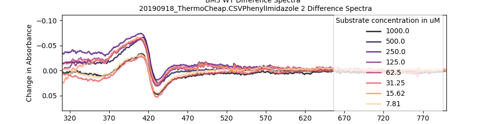
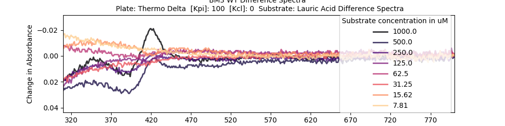

### Comparison of Two Thermo Plate Types
* [262160](https://www.thermofisher.com/order/catalog/product/262160?SID=srch-hj-262160) --Non-sterile	Non-Treated, £346.00 / 100
*   [164688](https://www.thermofisher.com/order/catalog/product/164688?SID=srch-hj-164688) --Sterile	Cell Culture Surface, £206.00 / 30

The **164688** plates were freebies (they sent me loads) but worked best by some margin on a [previous test](201906_PlateAssayDevelopment/11_Validation/readme.md). I spoke to a BMG sales rep, Dean Uddin, at a conference who said that probably the optical properties of the plastic are having a more major effect that the cellbind surface, so this is a fairly important test that can reduce the cost per plate to £6.86/plate to £3.46/plate.

It can also be a dry run for a validation (actual validation) test so that people will accept my assay.
Here's what [Uniprot](https://www.uniprot.org/uniprot/P14779) says about BM3 WT substrates.

```python
KM=250 µM for lauric acid at pH 7.4 at room temperature
KM=34 µM for N-beta-oxolauroyl-DL-homoserine lactone
KM=210 µM for N-beta-oxolauroyl-DL-homoserine
KM=140 µM for N-lauroyl-DL-homoserine
KM=322 µM for lauric acid at pH 7.5 and 15 degrees Celsius
KM=265 µM for lauric acid
KM=16 mM for indole
KM=87.4 µM for laurate/dodecanoate at pH 7.0 and 25 degrees
KM=230 µM for lauric acid at pH 7.41
KM=87.4 µM for laurate/dodecanoate at 25 degrees Celsius
KM=5.1 µM for arachidonate at 25 degrees Celsius
KM=42.4 µM for palmitic acid at pH 7.4 and 30 degrees
```

Everyone seems to be testing at around pH 7.5 and at a range of temperatures. Km and Kd I suppose are different, but we know that these are all substrates so this might be a good selection to check.

**********
### 20190818
I defrosted my protein from [Purification] and checked the concentration by taking a UV-Vis [trace](20190918_bm3ConcCheck.csv) diluted 2 in 1000. I ran [ProtinConcCheck.py](ProtinConcCheck.py) and found that my conc was 3.018172 µM which
```python
>>> 3.018172*500
1509.086
>>> def vol_to_use(c1,c2,v2):\
...     return (c2*v2)/c1
...
>>> vol_to_use(1509,10,5000) #10µM, 5 ml
33.13452617627568
```
is about 1509 µM


So I diluted the protien 33µl in 5000, took a UV-Vis trace, got confused about how much I would need, doubled up the volume, took another trace, then realised that wasn't necessary in the first place. Here's the [trace](20190918_bm3_WorkingStock.csv)
```python
$ python ProtinConcCheck.py -i 20190918_bm3_WorkingStock.csv
0   -0.017559
1    7.723621
2    7.311139
Name: P450 conc/uM, dtype: float64
```
Looks like I've got 7.3µM. It also genrated a [figure](20190918_bm3_WorkingStock.csvPlot.png)

I lay out my plates like this:


I span my plates at 3700 rpm in an Eppendorf centrifuge for a few minutes. When I scanned my plates on the PheraSTAR I had it do orbital shake-mixing at max speed for 20 seconds.

Here's the raw plate data:

|Plate Type|
|------|
|[164688 (Delta Surface)](20190918_ThermoDelta.CSV)|
|[262160 (Cheap One)](20190918_ThermoCheap.CSV)

I modified my [PlateAnalysis.py](PlateAnalysis.py) script a bit and ran it against both my files. Here's how it went:

### Corrected Specs
|COMPOUND|164688 (Delta Surface)|262160 (Cheap One)|
|-------|------------|-----|
|DMSO|||
|DMSO|||
|Arachadionic Acid|||
|Arachadionic Acid|||
|Lauric acid|||
|Lauric acid|||
|4-Phenylimidazole|||
|4-PhenylImidazole|||

### Difference Specs

|COMPOUND|164688 (Delta Surface)|262160 (Cheap One)|
|-------|------------|-----|
|DMSO|||
|DMSO|||
|Arachadionic acid|||
|Arachadionic acid|||
|Lauric acid|||
|Lauric acid|||
|4-PhenylImidazole|||
|4-PhenylImidazole|||

### Michaelis Menten Stuff
|COMPOUND|164688 (Delta Surface)|262160 (Cheap One)|
|-------|------------|-----|
|Arachadionic acid|||
|Arachadionic acid|||
|Lauric Acid|||
|Lauric acid|||
|4-PhenylImidazole|||
|4-PhenylImidazole||

### Conclusion
They Don't look so different. I think then the the Nunc plates are made out of a particularly clear plastic compared to the others I tested in [ref].

In the Michaelis menten plots, there's a consistent anomaly in the second highest concentration in each case. Looks like a pipette calibration error! I'll have them calibrated.

Lauric acid looks horrible throughout.
Here's what it looked like in [the last round of experiments](201906_PlateAssayDevelopment/11_Validation/readme.md) in the same buffer:

|Last time I used Lauric Acid|This Time (thermo Delta)|
|--------------|--------|
|||
|||
|||

It wasn't great in either, but it's way worse in today's experimment. Probably becuase the spin is barely shifting, and we're at the limits of the assay's sensitivity.
