### Plate vs titration
### 20191008

### Introduction
In the [last set of experiments](../12_ThermoPlateCompare/readme.md) I compared two 384 well plate types from Thermo:
* [262160](https://www.thermofisher.com/order/catalog/product/262160?SID=srch-hj-262160) --Non-sterile	Non-Treated, £346.00 / 100
*   [164688](https://www.thermofisher.com/order/catalog/product/164688?SID=srch-hj-164688) --Sterile	Cell Culture Surface, £206.00 / 30

I settled on **262160** because they worked just as well.
Today I'm working with BM3 Heme WT from [this purification](~/Documents/Work/201907_SceeningDesign/4_ExpressionPurification/201909_5ZIS_4KW/201909_4KEW_5ZIS_attempt1.md). I calculated it has an RZ value of ```0.511816``` which isn't great, but fine for this pilot study.

I'm testing some stocks I have of:
* Arachadionic acid
* Lauric acid
* Palmitic acid
* 4-phenylimidazole

### Draft protocol

##### Materials
* [262160](https://www.thermofisher.com/order/catalog/product/262160?SID=srch-hj-262160) --Non-sterile	Non-Treated Clear 384 well plate
* 96 well PCR plate for compound serial dilutions
* compound stocks in 10 mM DMSO
* 100 mM KPi pH 7 assay buffer
* Resevoirs, multichannel pipettes

##### Making the Plates
1. Make serial dilutions of the compounds in the assay buffer in the PCR plate starting with an 8% v/v DMSO + 10 mM compound in Buffer. Include a lane of DMSO dilutions in buffer to correct for DMSO-induced activity. Make at least 50 µl ofeach dilution.
2. For each compound, dispense into the corresponding columns in the 384 well plate, so that each compound is duplicated in adjacent rows (e.g. row 1&2 contain the same compound)
3. Dilute the P450 stock into a working stock at roughly 1-10µM in the assay buffer.
4. Dispense the protein into Odd-numbered rows
5. Dispense Buffer into even-numbered rows.
6. Centrifuge the plates at ~ 3000 rpm to remove bubbles and level ou the miniscus

##### Measurements
* Shake before measuring
* Scan each well from 800-220 nm

**Done**

##### Today's assay
Here's my column layout:
1. DMSO
2. Arachadionic acid
3. Arachadionic acid
4. Lauric acid
5. Lauric acid
6. Palmitic acid
7. Palmitic acid
8. 4-phenylimidazole
9. 4-phenylimidazole
10. Arachadionic acid
11. Arachadionic acid
12. Lauric acid
13. Lauric acid
14. Palmitic acid
15. Palmitic acid
16. 4-phenylimidazole
17. 4-phenylimidazole

Here's the [data from the plate reader](20191008_.CSV)
I forgot to measure my protein stock concentration before I used it, and I used all of it. Let's say that this one was a dry run.

| Raw Spec                                             | Difference Spec                                       | Michaelis Menten                                    |
|:-----------------------------------------------------|:------------------------------------------------------|:----------------------------------------------------|
| 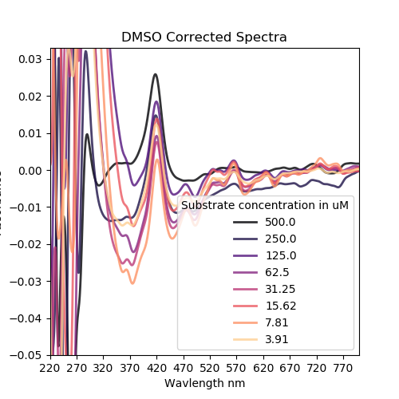              | 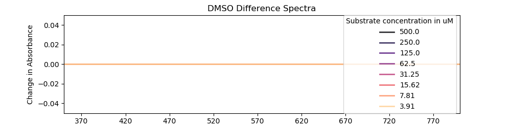              | 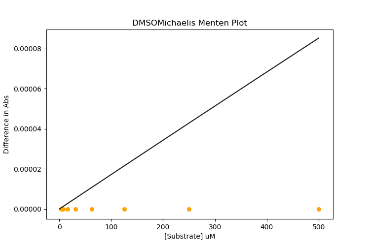              |
| 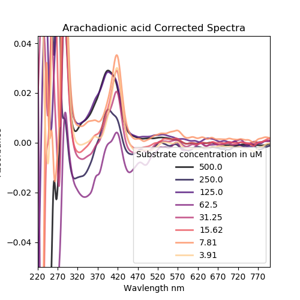 | 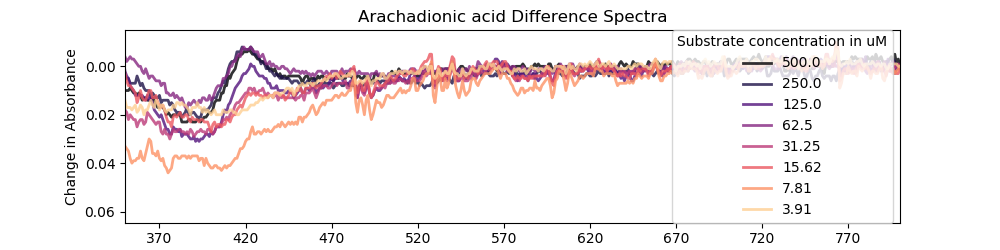 | 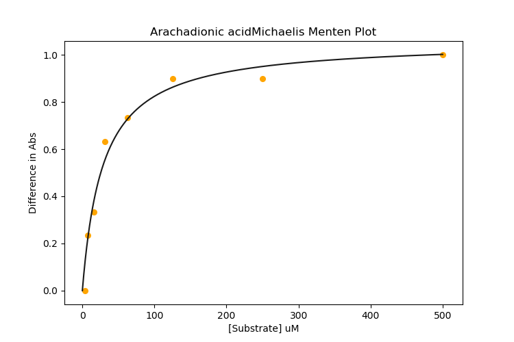 |
|  |  |  |
| 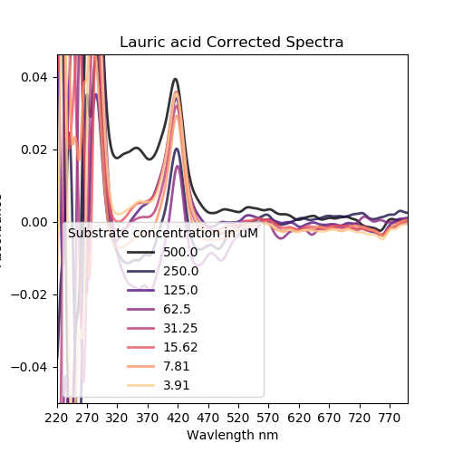       | 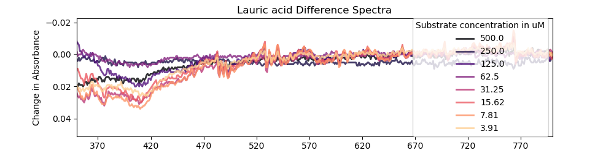       | 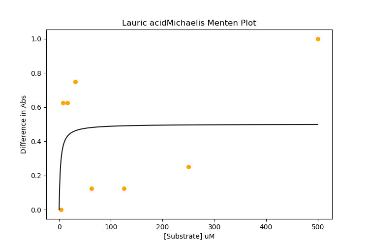       |
|        |        |        |
| 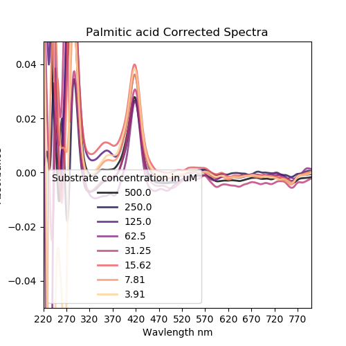     | 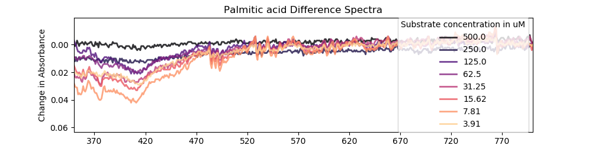     | 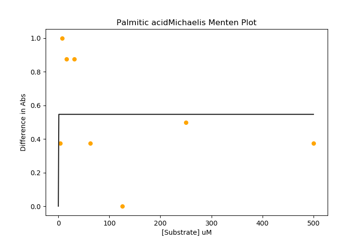     |
|      |      |      |
| 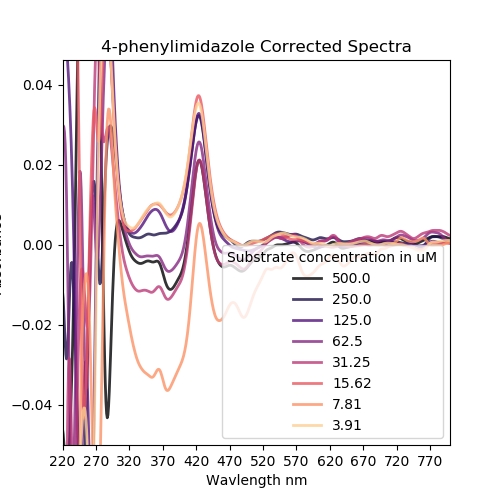 | 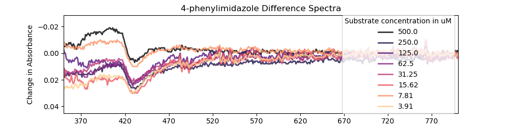 | 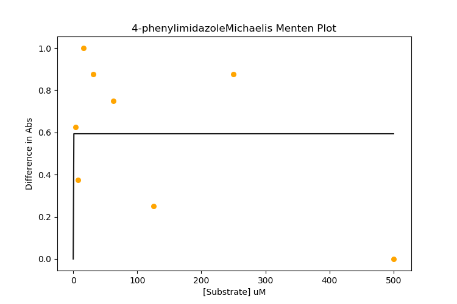 |
|  |  |  |
|  |  |  |
|  |  |  |
|        |        |        |
|        |        |        |
|      |      |      |
|      |      |      |
|  |  |  |
|  |  |  |

I think I should use a higher conc of protein next time, and also work on my analysis script. Maybe have it make a new directory or something. Unique naming system would be cool. Being able to handle inhibitors is a high priority too. maybe also a gaussian smoothing??
A sensitivity / error metric would be good too for training my models down the line. 
