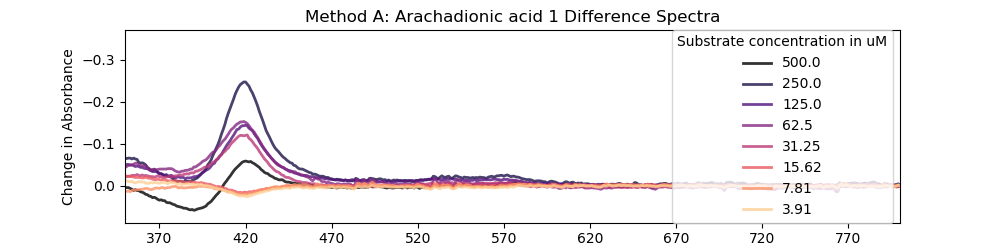

### 20191018 Serial Dilution Scheme

I presented some of my work at a group meeting two days ago and had a suggestion for my assay: Keep a constant concentration of DMSO in all wells (4%) and do my dilutions in the DMSO itself before adding buffer. This may help solublise any tricky ligands.

The BM3 WT Heme stock has been thawed for nearly two weeks now (kept on ice for most of it) so I centrifuged it at 13000 rpm at 4°C for 20 mins, then kept the supernatant.
I took a spec of it, here's the [data](20191018_bm3_plateWorkingStockConcCheck.csv).

|                           |       RZ values: |
|:--------------------------|---------:|
| blank                     | 1.15626  |
| bm3_workingStock_2in100   | 0.546494 |
| bm3_workingStock_2in100.1 | 0.539857 |

|                           |   P450 conc/uM |
|:--------------------------|---------------:|
| blank                     |     -0.0253418 |
| bm3_workingStock_2in100   |     14.0155    |
| bm3_workingStock_1in100.1 |      6.82024   |

I used the 6.8 µM stock for my plate assay.

I used Arachadionic acid and SDS (10 mM in DMSO) for this test becuase I had it to hand.
Here's a rundown of the two methods I used:
 * **Method A** (the old method) I serial  dilute 8% V/V DMSO with 10 mM compound / buffer (100 mM KPi, pH7) by half into more buffer, so the DMSO concentration become really low by the end, which may lead to problems with compound solubility, I'm not sure. The serial dilution here is diluted by an extra half by the time it gets into the plate, so the final concentration never eceeds 4%, which is good for the protein.
 * **Method B** A method that was suggested to me. In this one I keep the final concentration of DMSO constant (4% for in the assay plate, 8% whilst diluting), and then do my serial dilution in the DMSO before adding the buffer.

 I filled columns in the plate like this:
* 1 & 2: **Method A** DMSO
* 3 & 4: **Method A** Arachadionic acid
* 5 & 6: **Method A** SDS
* 7 & 8: **Method B** DMSO
* 9 & 10: **Method B** Arachadionic acid
* 11 & 12: **Method B** SDS

I span the plate at 3700 rpm for a few mins to get rid of bubbles and that. Then I scanned each well from 220-800 nm in a BMG PheraStar (with 30S of fast orbital shaking before).

I ran this version of [PlateAnalysis.py](PlateAnalysis.py) and got this out:

| Raw Spec                                                          | Difference Spec                                                    | Michaelis Menten                                                 |
|:------------------------------------------------------------------|:-------------------------------------------------------------------|:-----------------------------------------------------------------|
|               |               |               |
|               |               |               |
|  |  |  |
|  |  |  |
|                |                |                |
|                |                |                |
|               |               |               |
|               |               |               |
|  |  |  |
|  |  |  |
|                |                |                |

|                               |       vmax |          Km |         R^2 |
|:------------------------------|-----------:|------------:|------------:|
| Method A: DMSO 1              | 0.00797792 | 46340.4     | -inf        |
| Method A: DMSO 2              | 0.616038   |     9.94004 |    0.310409 |
| Method A: Arachadionic acid 1 | 0.885774   |    36.9242  |    0.802169 |
| Method A: Arachadionic acid 1 | 0.863691   |    49.6443  |    0.77788  |
| Method A: SDS 1               | 0.815886   |    24.8807  |    0.673114 |
| Method A: SDS 2               | 0.815657   |    27.9064  |    0.689325 |
| Method B: DMSO 1              | 0.778233   |    17.4243  |    0.486884 |
| Method B: DMSO 2              | 0.765169   |    15.9011  |    0.449026 |
| Method B: Arachadionic acid 1 | 0.849269   |    14.1502  |    0.546063 |
| Method B: Arachadionic acid 2 | 0.838064   |    14.9833  |    0.540668 |
| Method B: SDS 1               | 0.935062   |    31.374   |    0.782434 |

My multichannel pipette needs recalibrating! It's registered to be recalibrated at some point but I'm not sure when.
