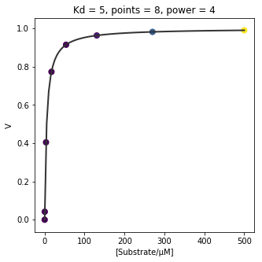
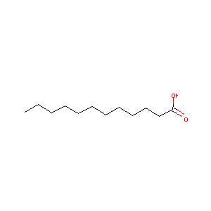
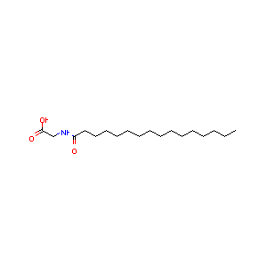

# Preliminary Experiments!
## TL;DR
Experiments that looked at some assay parameters. The tests revealed a problem with light scattering hat may obscure some important data, which is probably because the protein is precipitating because of some interaction with the plastic assay plate.

## Contents
* Aim of the experiments
* Parameters being tested
* Method
* Results and analysis


### Aim of the experiments
These experiments are to make a version of a classical P450 binding tiration in a plate. Classical titrations iteratively add test compounds to a cuvette, mix and then record the changes in the UV-Vis absorbance profile. Changes at 390 and 420 nm are used to calculate the dissosciation constant,*K* ~d~.

### Parameters being tested
At the time of designing these experiments, I was set on using a factorial-style design, which is [here](2018_Data/20180924-FullFatDesign.csv). I was messing with:
* Vol/µl
* Prot/µM 
* No. Concs (of substrate)
* and a power constant

My end point was going to be the standard deviation of *K* ~d~, which I am trying to minimize. The power constant here either bunches up the substrate concentrations near low values, or more evenly, depending on its size. Here's an illustrative example:


See how some of the concentration points are bunched up. It's copied from and [old notebook](2018_Data/20180913-Distribution functions.ipynb)
### Method
I was working with the two substrates: [Lauric Acid](https://pubchem.ncbi.nlm.nih.gov/compound/Lauric-acid) and [N-Palmitoylglycine](https://pubchem.ncbi.nlm.nih.gov/compound/151008):

```python

>>> import rdkit.Chem as Chem
>>> import  rdkit.Chem.Draw as draw
>>> Lauric_acid = Chem.MolFromSmiles('CCCCCCCCCCCC(=O)O')
>>> N_Palmitoylglycine = Chem.MolFromSmiles('CCCCCCCCCCCCCCCC(=O)NCC(=O)O')
>>> N_PalmitoylglycineIMAGE = draw.MolToImage(N_Palmitoylglycine)
>>> Lauric_acidIMAGE = draw.MolToImage(Lauric_acid)
>>> Lauric_acidIMAGE.save('Lauric_acid.png')
>>> N_PalmitoylglycineIMAGE.save('N_Palmitoylglycine.png')

```
|Lauric Acid|N-Palmitoylglycine|
|----|-----|
|  ||

Which are natural substrates for my enzyme P450 BM3 Heme domain (wild type).I planned my plate layouts in this (mess) script: *Placeolder* 
* I dispensed my compounds with an Echo 550
* I dispensed my protein with a Thermo Multidrop Combi, which is basically a peristaltic pump
* My protein was thawed from -80 storage and diluted in the assay buffer: 100 mM KPi, pH 7. I checked the protein concentrations using a Varian UV-Vis Spectrometer using the equation *Placeholder* and diluted to the desired final concentrations.
* I read my plates on a BMG-Pherastar set to full trace mode (sweep all wavelengths). These machines read fast, but transfer of data to the connected PC was slow, would love tips on how to make it faster.

### Results and analysis
Here are some files:
[1]('180918_1753.csv'),
[2]('180918_1845.csv'),
[3]('180918_1818.csv'),
[4]('180918_1747.csv'),
[5]('180918_1913.csv'),
[6]('180918_1854.csv'),
[7]('180918_1800.csv'),
[8]('180918_1810.csv'),
[9]('180918_1826.csv'),
[10]('180918_1745.csv'),
[11]('180918_1839.csv'),
[12]('180918_1904.csv')

I'll match them up with the experimental conditions later
