### Aim
Same as before let's do it some more!

### Lab notes
I made a table of everything I tried to weigh out as substrates. We ran out of N-palmitoylglycine, so none of that today. Sodium Dodecyl Sulfate is a surfactant and potentially a substrate for BM3, 4-PhenylImidazole is a known inhibitor, and should yeild a different type of spin shift which might be interesting, and Arachadonic Acid is another known BM3 substrate.

Here's my plate layout this time:
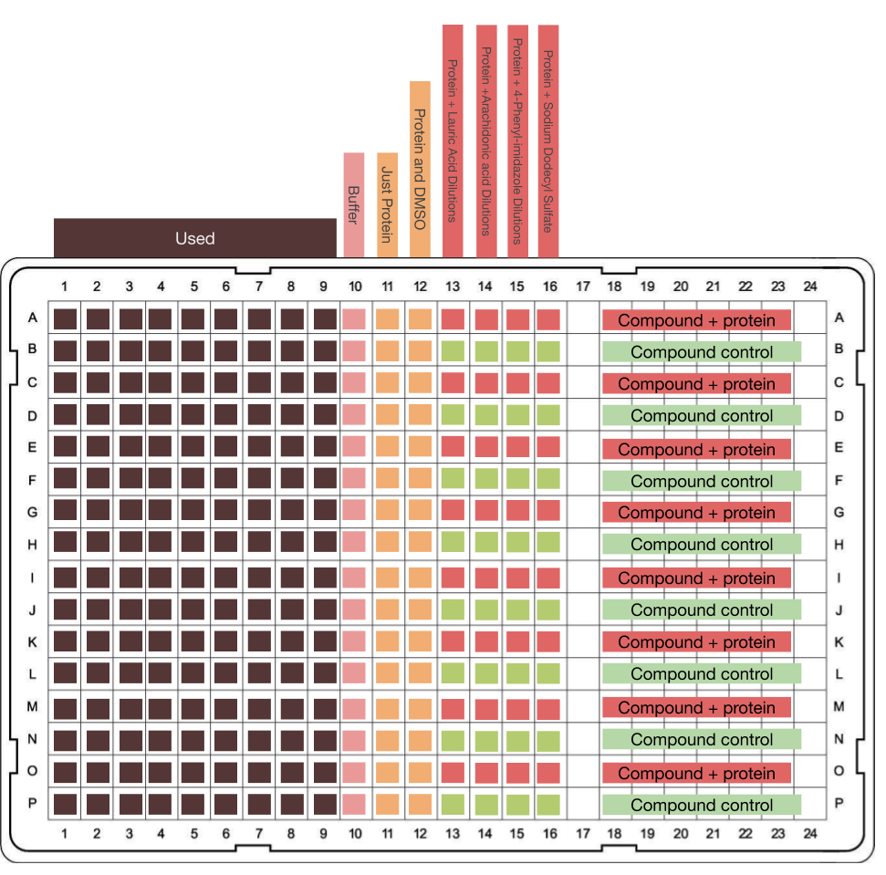
The idea was to correct for any potential compound absorbance by having control wells where the compound is at the same concentration as the well above, but there's no protein. There may be some pipetting errors in there because when I was pipetting out my compounds from the dilution plates to the test plate, I forgot to leave a dead volume, which will mess things up.


```python
>>> import pandas as pd
>>> data = pd.read_csv('20190607_SubstrateWeighing.csv')
>>> data['mols'] =data[' Actual Weight (mg)']/(data[' Mw']*1000)
>>> data['VolDMSO (mM)']= (data['mols']/0.01)*1000 # convert from L to mL
>>> data['Vol DMSO to add to make 50 mM'] = (data['mols']/0.05)*1000
>>> data
   Unnamed: 0                Compound      Mw   Actual Weight (mg)      mols  VolDMSO (mM)  Vol DMSO to add to make 50 mM
0           0             Lauric acid  222.30                 15.0  0.067476      6.747638                       1.349528
1           1  Sodium Dodecyl Sulfate  288.40                  7.1  0.024619      2.461859                       0.492372
2           2           Plamitic Acid  256.42                 19.6  0.076437      7.643710                       1.528742
3           4       4-PhenylImidazole  144.18                 12.6  0.087391      8.739076                       1.747815
4           5        Arachadonic Acid  304.48                  5.2  0.017078      1.707830                       0.341566

```
I made them 50 mM and then diluted because my vials that I weighed the compounds out into were too small to hold more than 2 ml.


Some working for protein cooncentration calcs
```python
>>> nwells = 8*16 #5 compounds, run out of NPG. 1 row of pure protein, 1 row of prot+DMSO 2.5%, 1 row of prot+DMSO 5%
>>> total_assayVol = nwells*1.5*50 #uL, 1.5x safey margin
>>> target_proein_vol = total_assayVol/2
>>> prot_conc = 983.4087522105264

>>> target_proein_vol
4800.0
>>> target_proein_vol*20 # target protein conc is 20 uM
96000.0
>>> 96000.0/prot_conc
97.61963149525488
```

Here's a UV-Vis trace of the diluted BM3: [data](20190607_BM3conccheck.csv). 
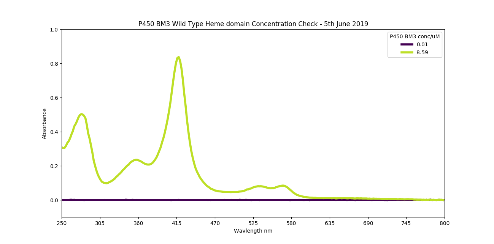
8.59 uM of BM3 here, so 4.295 uM final concentration in the plate.


### Results
|Lauric acid|
|----|
|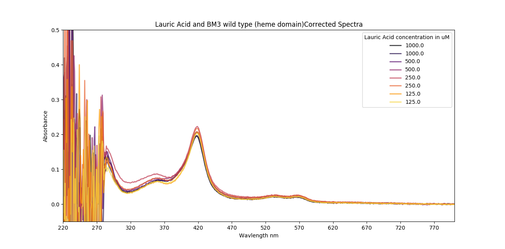|
|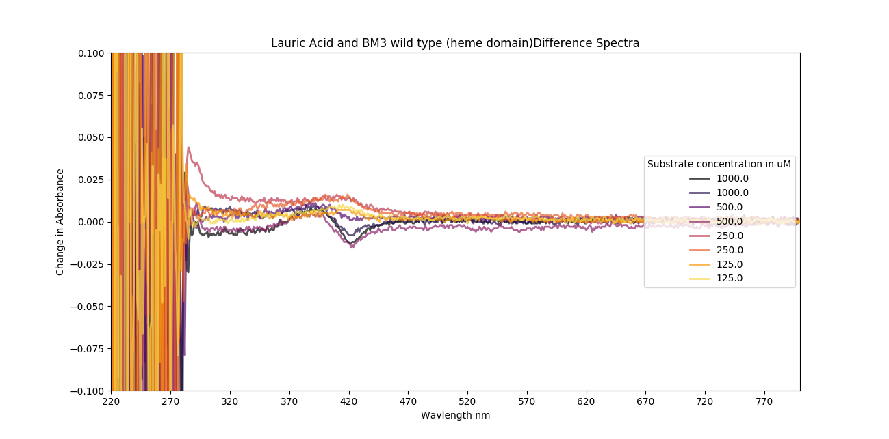|
|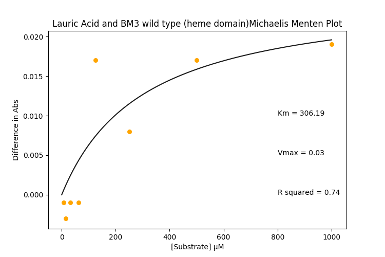|


|Arachidonic acid|
|----|
|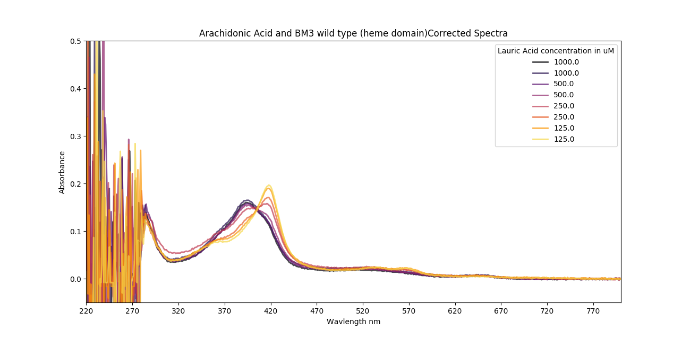|
|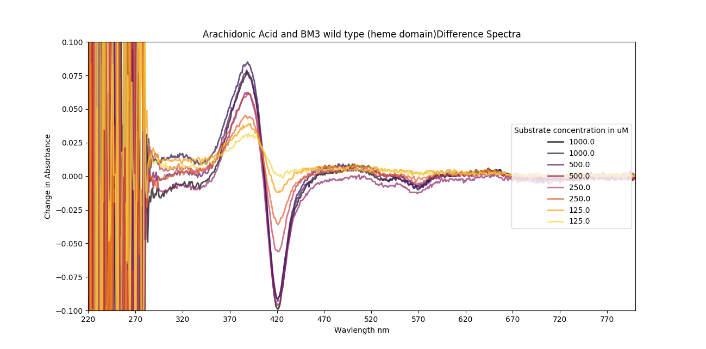 |
|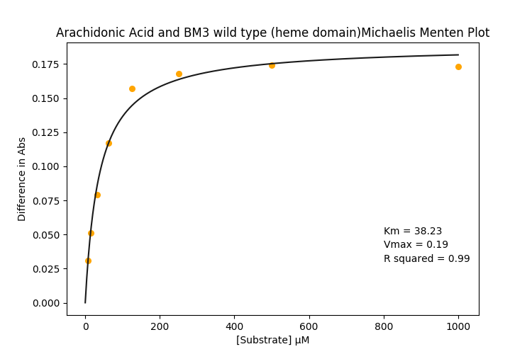|

|SDS|
|---|
|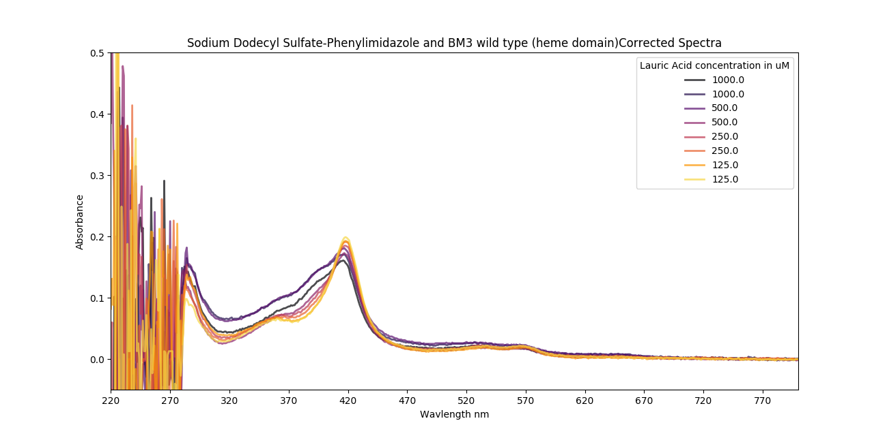|
|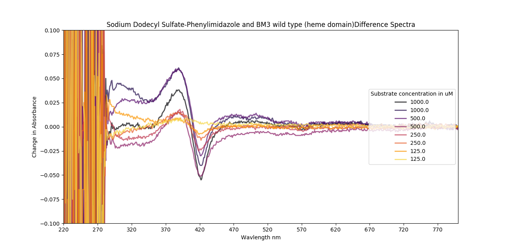|
|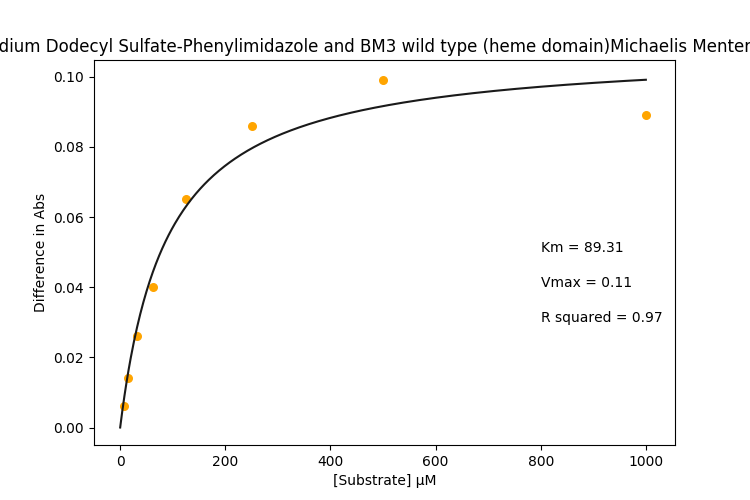|

|4-PhenylImidazole|
|-------|
|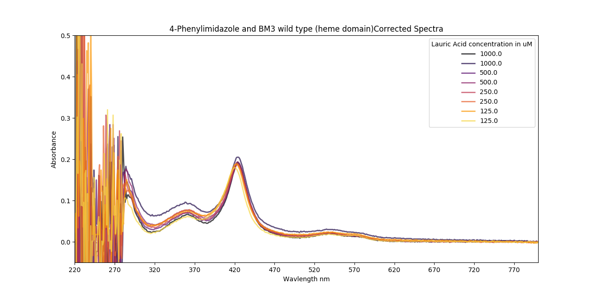|
|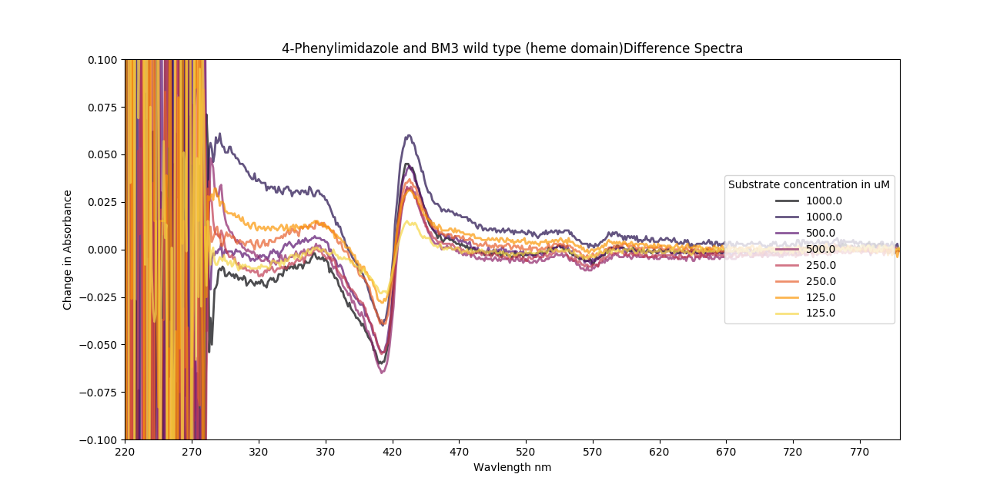|
