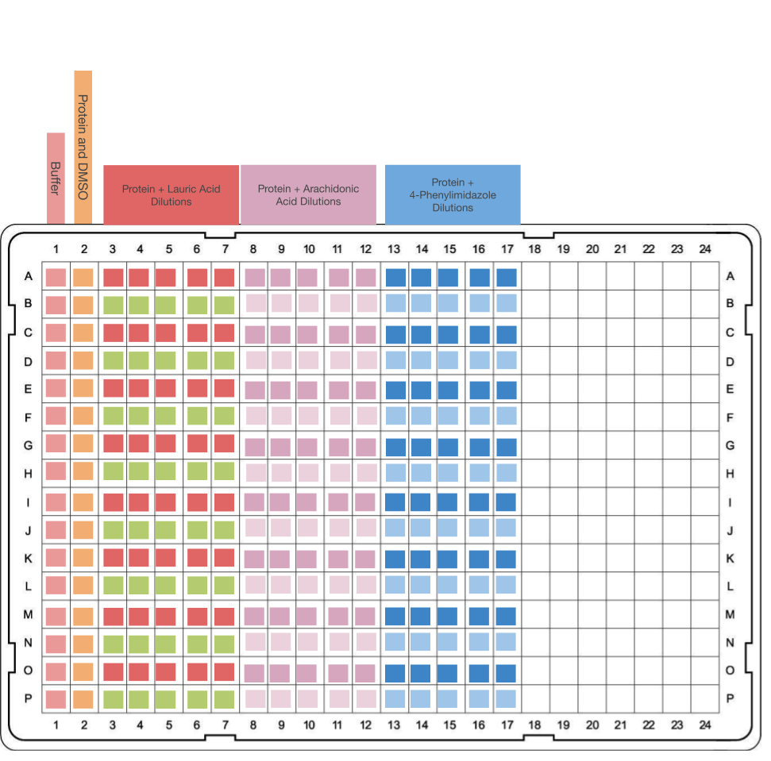
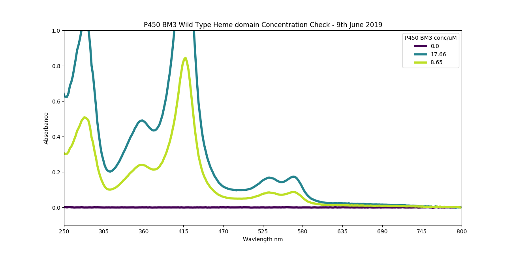
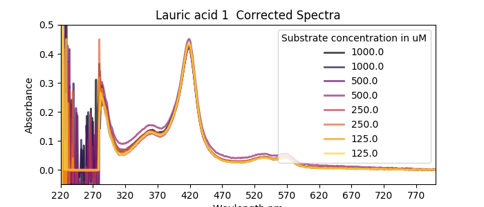
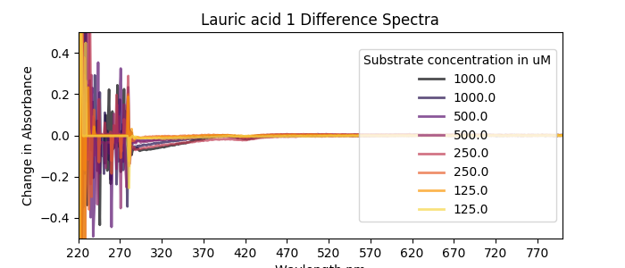
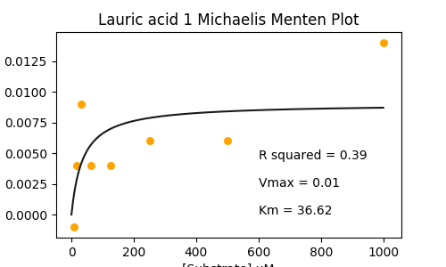

### Aim
Same as before let's do it some more!

### Lab notes
I made a table of everything I tried to weigh out as substrates. We ran out of N-palmitoylglycine, so none of that today. Sodium Dodecyl Sulfate is a surfactant and potentially a substrate for BM3, 4-PhenylImidazole is a known inhibitor, and should yeild a different type of spin shift which might be interesting, and Arachadonic Acid is another known BM3 substrate. I decided to use 4% v/v DMSO in the assay plate because 2.5% might have led to substrate precipitation and 5% is right on the line of how much I heard that BM3 can take.

Here's my plate layout this time:

The idea was to correct for any potential compound absorbance by having control wells where the compound is at the same concentration as the well above, but there's no protein. There may be some pipetting errors in there because when I was pipetting out my compounds from the dilution plates to the test plate, I forgot to leave a dead volume, which will mess things up.


```python
>>> import pandas as pd
>>> data = pd.read_csv('20190607_SubstrateWeighing.csv')
>>> data['mols'] =data[' Actual Weight (mg)']/(data[' Mw']*1000)
>>> data['VolDMSO (mM)']= (data['mols']/0.01)*1000 # convert from L to mL
>>> data['Vol DMSO to add to make 50 mM'] = (data['mols']/0.05)*1000
>>> data
   Unnamed: 0                Compound      Mw   Actual Weight (mg)      mols  VolDMSO (mM)  Vol DMSO to add to make 50 mM
0           0             Lauric acid  222.30                 15.0  0.067476      6.747638                       1.349528
1           1  Sodium Dodecyl Sulfate  288.40                  7.1  0.024619      2.461859                       0.492372
2           2           Plamitic Acid  256.42                 19.6  0.076437      7.643710                       1.528742
3           4       4-PhenylImidazole  144.18                 12.6  0.087391      8.739076                       1.747815
4           5        Arachadonic Acid  304.48                  5.2  0.017078      1.707830                       0.341566

```
I made them 50 mM and then diluted because my vials that I weighed the compounds out into were too small to hold more than 2 ml.


Some working for protein cooncentration calcs
```python
>>> nwells = 8*16 #5 compounds, run out of NPG. 1 row of pure protein, 1 row of prot+DMSO 2.5%, 1 row of prot+DMSO 5%
>>> total_assayVol = nwells*1.5*50 #uL, 1.5x safey margin
>>> target_proein_vol = total_assayVol/2
>>> prot_conc = 983.4087522105264

>>> target_proein_vol
4800.0
>>> target_proein_vol*20 # target protein conc is 20 uM
96000.0
>>> 96000.0/prot_conc
97.61963149525488
```

Here's a UV-Vis trace of the diluted BM3: [data](20190607_BM3conccheck.csv). 

8.59 uM of BM3 here, so 4.295 uM final concentration in the plate.


### Results
|Compound|Comments|
|-------|-----|
|Lauric Acid|Bad, it looks like I've not dispensed it properly|
|Arachadionic Acid|Looks Good|
|SDS|Looks good|
|4-Phenyl Imidazole|Looks good, haven't made a script to process inhibitors yet though|


### Plots
|Lauric acid|
|----|
||
||
||


|Arachidonic acid|
|----|
||
| |
||

|SDS|
|---|
||
||
||

|4-PhenylImidazole|
|-------|
||
||


This is exciting and promising. I came in to the lab on Sunday 9th June to have another stab at it. It was a hastily thought out experimental run, probably made loads of mistakes but it's all practice isn't it? This time I decided to do 5 repeats of the following substrates:
1. Lauric acid (to see if I could make up for last time)
2. Arachadnoic acid (because it came out so well last time)
3. 4-PhenylImidazole (I should probably prepare myself for some inhibitors at screen time)

I started with a fresh Corning 3640 plate (which it turns out aren't non-treated, I should really have a look at non-treated, cheap and cheerful plates soon). Here's my new layout:



I might have messed up some of the compound blanks because I was pipetting from a deep well mother plate and I don't think my tips got all the way to the bottom each time - just a feeling. Eventually, once I'm really good at this or can get a robot to do it then I should compare againts titrations (but I hate titrations so I'm only doing them when I really need to). I used a final ```[DMSO]``` of 4% v/v

Protein: I did some sketchy calculations again to dilute it, here's the [final trace](20190609BM3ConcCheck.csv). 
And here's a plot of the trace. I had to dilute it in half the second time to get the a420 between 0 and 1 which apparently is where things are accurate.

Though
```python
>>> 17.66/2
8.83
```
which isn't far off. Maybe it's fine.

Here's the plate [data](SerialDilfattyacids.CSV)
And here are some smaller figures than before.

|  |||

I calculated some Kds and stuff and put it here in a table:
```python
                             Vmax           Kd       R^2
protein+DMSO         2.669067e-01    -0.226848  0.417604
Lauric acid 1       -2.150494e-35     2.000000      -inf
Lauric acid 2        9.031120e-03    36.623412  0.393817
Lauric acid 3        3.229573e-02     5.355799  0.157139
Lauric acid 4        5.289297e-02   236.417082  0.642277
Lauric acid 5        8.866792e-02   490.473143  0.506235
Arachadonic acid 1   3.505953e-02    12.662041  0.470197
Arachadonic acid 2   3.729962e-01  3493.117058  0.564861
Arachadonic acid 3   4.091849e-01    88.242838  0.983755
Arachadonic acid 4   4.082436e-01    82.663486  0.980789
Arachadonic acid 5   4.300772e-01    96.269076  0.987716
4-Phenylimidazole 1  4.183990e-01    79.252519  0.967969
4-Phenylimidazole 2  4.093374e-01    71.716778  0.983733
4-Phenylimidazole 3  4.176815e-02     5.129344  0.153933
4-Phenylimidazole 4  3.484336e-02     3.730405  0.464898
4-Phenylimidazole 5  3.837007e-02    17.917318  0.748812
```
I'll get the stdev for each compound ater, but it won't be very good. Maybe a good test later on will be to compare lots of stdevs for lots of compounds, between plates and old school titrations??
