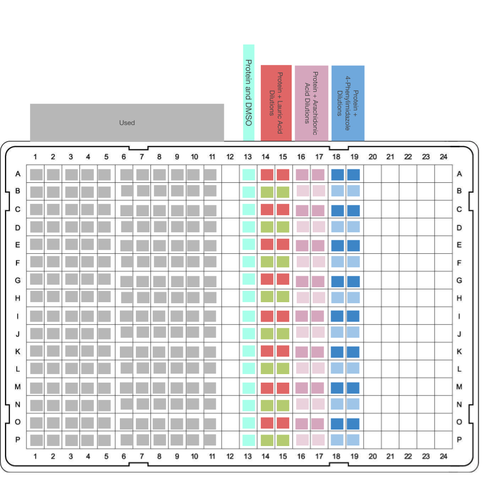
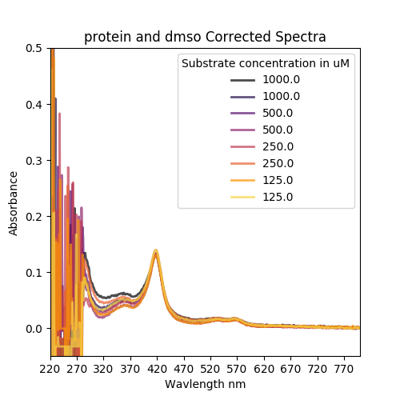
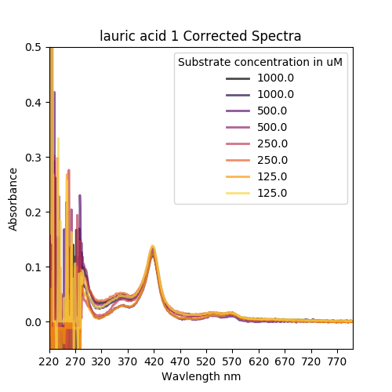
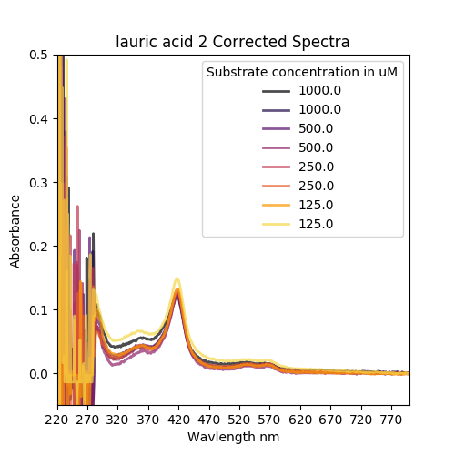
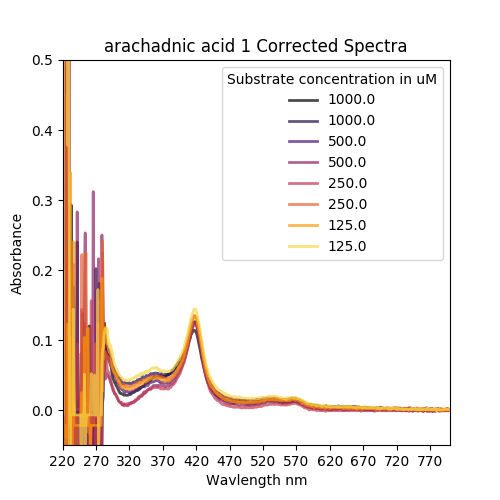
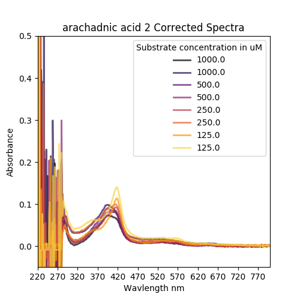
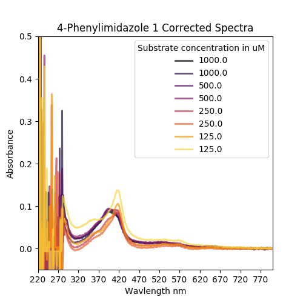
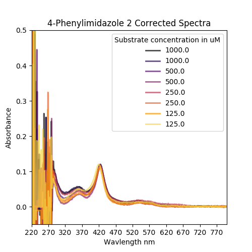

### header


### Lab Notes
* Defrosted some BM3 Heme WT from -80 storage. Took a UV-Vis trace diluted 5 in 1000 in 100 mM KPi pH7 and generated the figure below and the conc with [this script](20190618_ProtinConcCheck.py	)

```python
>>> 5.9/0.005
1180.0
```
1180.0 uM = 1.18 mM

5 in 1000 looked good so I'll do 10 ml of that, which is 50 uL of protein.
Here's a conc check added to the previous trace session:
[data](20190618_BM3StckConcCheck2.csv	) which I did the same as before, here's another [figure](20190618_BM3StockConc_2.png) if you're interested 


Here's the plate layout:


I'm doing my serial diutions in a PCR plate that I have to hand (last time a deep well plate went badly, ended up pipetting up a lot of air). Each of the PCR plate wells needs 150 ul of substrate and buffer plus some dead volume so I'm doing 200 ul. The first wells are going to loose half their volume

###### 30 mins later
I did the above, which seemed to work, except I'm sure I mixed up some wells because I'm a stoopid. Whatever, I span the plate at ~ 4000 rpm for 3-4 mins and then took spectral traces of the used wells on the Pherastar FS, here's the [data](20190618_Assay1.CSV).

I did a couple of plots  but it looks like I donked up the pipetting again, so I'm going again!


##### Same as before, let's do it some more

Here's my plate layout:




Here's some data:

|Compound|Rep 1|Rep 2|
|---|---|---|
|DMSO|||
|Lauric Acid|||
|Arachadonic Acid|||
|4-PhenylImidazole|||
