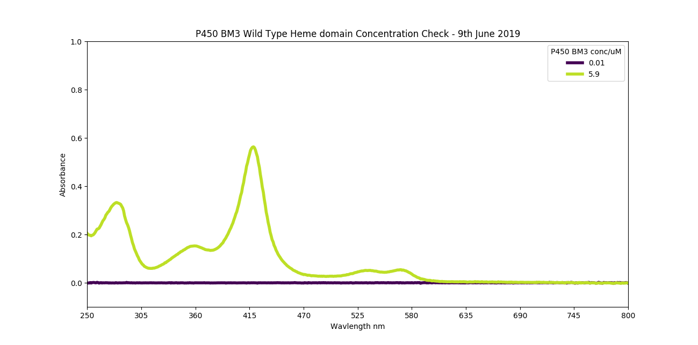
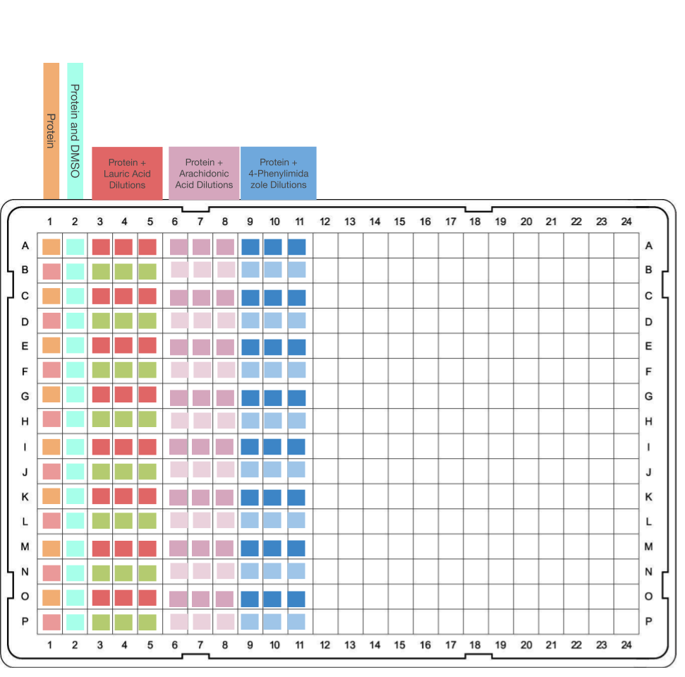

### header


### Lab Notes
* Defrosted some BM3 Heme WT from -80 storage. Took a UV-Vis trace diluted 5 in 1000 in 100 mM KPi pH7 and generated the figure below and the conc with [this script](20190618_ProtinConcCheck.py	)

```python
>>> 5.9/0.005
1180.0
```
1180.0 uM = 1.18 mM

5 in 1000 looked good so I'll do 10 ml of that, which is 50 uL of protein.
Here's a conc check added to the previous trace session:
[data](20190618_BM3StckConcCheck2.csv	) which I did the same as before, here's another [figure](20190618_BM3StockConc_2.png) if you're interested 


Here's the plate layout:


