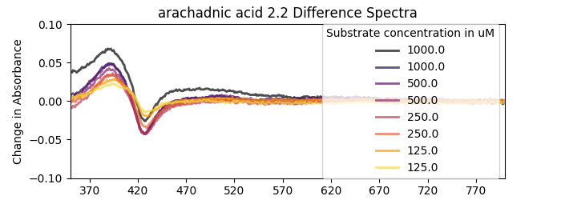
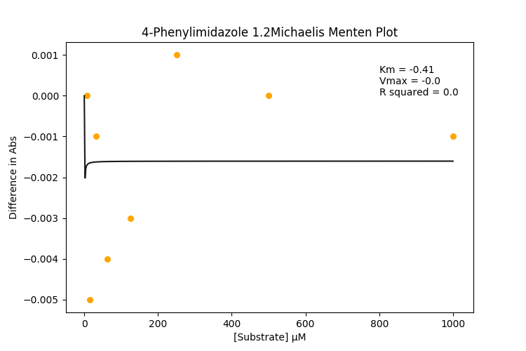
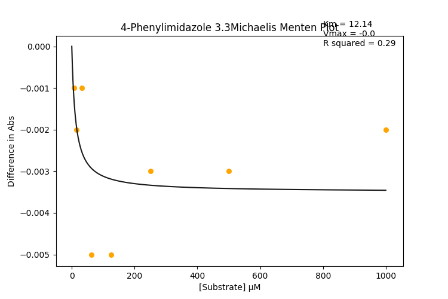

#### 5. more iterations

##### Background

In the previous attempts I've found that the assay works, and I can get some reasonably clean Michaelis Menten curves out. The biggest issues I've encountered are errors that I'm chalking up to my lack of pipetting skills.

###### Aim
I want to get a protocol written soon for manual preparation of the plates. Maybe I'll also make one for 96 well plates for people who want that. I think I need to have this protocol road tested with Wild type P450 BM3 (which is lucky because I have lots of that) and some of its natural substrates and an inhibitor, So I'm going to whittle down my selection to just Arachadonic acid (substrate) and 4-Phenylimidazole (inhibitor).

Eventually, it will be good to have a robotics workflow for all of this, but one step at a time James.

##### Today
I think the first thing I need to do is to get some consistent results with Arachadonic acid and 4-Phenylimidazole. So far I haven't been making repeats in the mother plate, so maybe I'll try that. I don't think I should draw more than about 2 or 3 repeats from each column in the (PCR) mother plate, which only just fits 300 ul in each well.

At least I'll have company


### plate layout


#### How did it go?
I learnt:
* 1 PCR plate well won't stretch to 3 reps (6*25 = 300) because there's no dead volume. Good to know.
* About 5 ml of protein stock does most (19 columns) of the plate.

```python
>>> ((384/2)*25)/1000. # half the wells are used, ans in ml
4.8
```

I diluted some defrosted P450 BM3 (wild type, heme  domain) in my assay buffer (100 mM KPi, pH 7) and took a UV-Vis trace. Here's the [data](20190619_BM3StckConcCheck.csv). I used this [script](ProtinConcCheck.py) to calculate the protein concentration.

```python
$ python3 ProtinConcCheck.py
0   -0.010393
1    4.012766
Name: P450 conc/uM, dtype: float64
```

I made up the plate, which took maybe 15-20 minutes? Then span it in the Cai lab's centrifuge at 1000 rpms for 4 minutes, then took a scan on the Pherastar FS from 220-800 nm. Here's the [data](20190619_boi.CSV) and here's my [script](Plateanalysis20190618.py)

## Arachadonic Acid specs look Bangin'!!!!!!!

|Corrected Specs| Difference Specs| Michaelis Menten Curves|
|---------|---------|---------|
|| | |
| |  | |
||| |
||| |
||| |
||| |
||| |
||| |
||| |

### 4-PhenylImidazole needs work

|Corrected Specs| Difference Specs| Michaelis Menten Curves|
|---------|---------|---------|
|| | |
| |  | |
||| |
||| |
||| |
||| |
||| |
||| |
||| |


#### What did I learn?
The assay works, need to road-test it with more native substrates to show that I haven't just optimised it for arachadnic acid. (I need to earn to spell that).
I need to re-make my 4-Phenylimidazole stocks because it looks crazy variable. I should also make an inhibition detection script so that the trace data can be processed accordingly. Though will I be using inhibitors in my final screen? Probably not! Maybe I can burn that bridge when I come to it :fire:

##### Tomorrow
* Run the assay again except with more fatty acids!!
* Maybe start writing a legit protocol. And check if there's a standard way of doing that.
