#### More

Re-weighing Lauric acid and Palmitic acid stocks

```python
>>> 256.42*0.01*0.001 #Palmitic acid mw * 10 mM * 1 ml
0.0025642
>>> 0.0025642 *1000 # mg
2.5642
>>> 200.32*0.01*0.001*1000 #Lauruc  acid mw * 10 mM * 1 ml * mg
2.0032
>>> 24.38/2.56 # Target weight / acutal (palmitic)
9.5234375
>>> 57.4/2.00 # Target weight / acutal (lauruc)
28.7
>>> 2870/2 # Lauruc acid fo 200 mM in less than 1.5 ml
1435
```

|Compound|Target Conc|Target Vol|Target Weight/mg|Actual Weight/mg|Vol DMSO for 10 /ml|
|-------|-----------|---------|--------------|------------|------------------|
|Palmitic acid|10 mM| 1 ml| 2.56|24.38|9.52|
|Lauric Acid|10 mM| 1 ml| 2.00|57.4|28.7|

The vials are 1.5 ml so I'm doing 100 mM then serial dilution.

|Compound| Target Conc| Vol DMSO/ul|
|------|---------------|------------|
|Palmitic acid|100 mM|952|
|Lauric Acid|200 mM|1435|

Palmitic acid hasn't been dissolving, so for this assay I'm just going to use SDS in its place:


Did the usual, didn't notice any mistakes but we'll see.
Here's the concentration check [data](20190622_BM3conccheck.csv) and here's the [script](ProtinConcCheck.py)

```python
$ python3 ProtinConcCheck.py
0    0.001906
1    3.807105
Name: P450 conc/uM, dtype: float64
```

cool.

|Corrected Specs| Difference Specs| Michaelis Menten Curves|
|---------|---------|---------|
|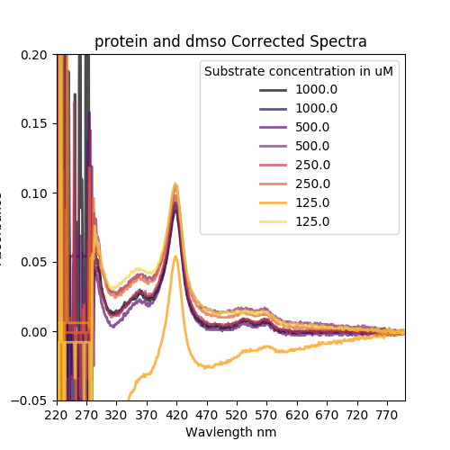|||
|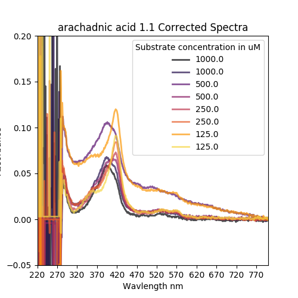|||
||||
||||
|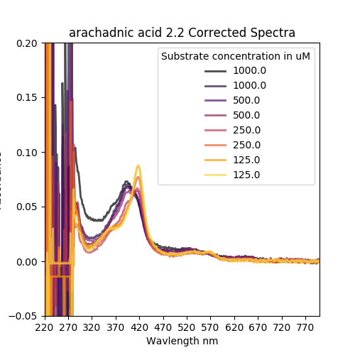|||
|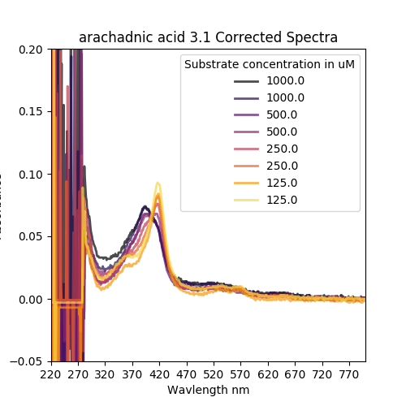|||
||||
||||
||||
||||
||||
||||
||||
||||
||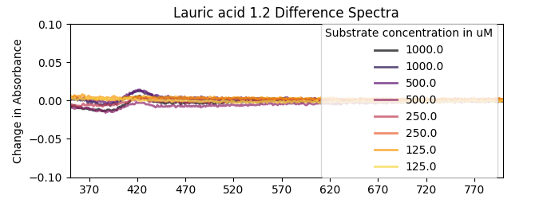||
||||
||||
||||
||||


FFS what have I done

#### 20190625
Back again. Let me pick up where I left off: Weird results so I'm checking if my stocks are ok. I did some titrations on one of the virus-riddled Cary UV-Vis specs, but my pen drive isn't affected so we're good. The royal we.
* [BM3 conc check](20190625_BM3conccheck.csv)
* [BM3 with lauric acid](20190625_BM3Lauric1.csv)
* [More BM3 with Lauric acid](20190625_BM3Lauric2.csv)
* [Lauric acid again except after centrifuging](20190625_BM3Lauric3centrifugepot.csv )
* [Palmitic acid before spinning down my protein](20190625_BM3Palmiticprecentrifugepot.csv)
* [Palmitic acid except after spinning the protein](20190625_BM3Palmiticcentrifugepot.csv)

A lot of precipitation, at this point I'm thinking the problem is my protein, it's been out for some time. Results were slightly better with Lauric acid after I span the concentrated Protein at 13000 rpm for about 10 mins at 4 degrees.

* I used [this script](CaryUVVisProcessing.py)

|Specs|
|------|
|| ||
||
||
||
||

Yep looks like a protein problem.
I span the protein down at 13000 rpm again at 4 deg and then transferred it to a fresh tube.

Made fresh assay buffer (100 mM KPi, pH7, filtered) and diluted the protein in it. Here's the [trace](20190625_PM_BM3conccheck.csv)

```python
 ProtinConcCheck.py
0   -0.017053
1    3.892163
Name: P450 conc/uM, dtype: float64
```

then set up my plate like this:


And here's the [data](20190625_boi.CSV)


|Raw spectra|Difference Spectra|Michaelis Menten Plot|
|------------|-------------|----------|
||||
||||
||||
||||
||||
||||
||||
|||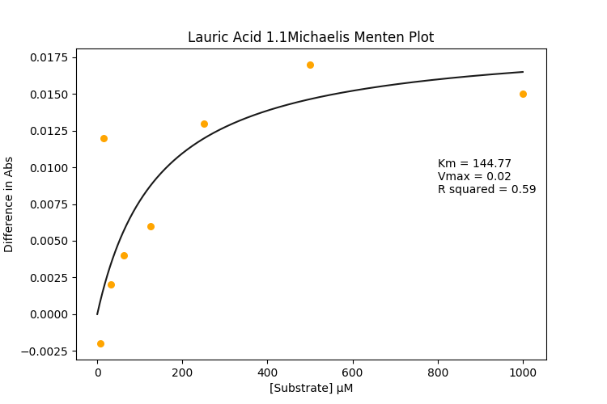|
||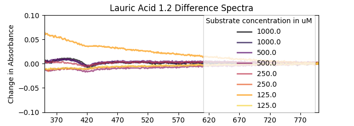|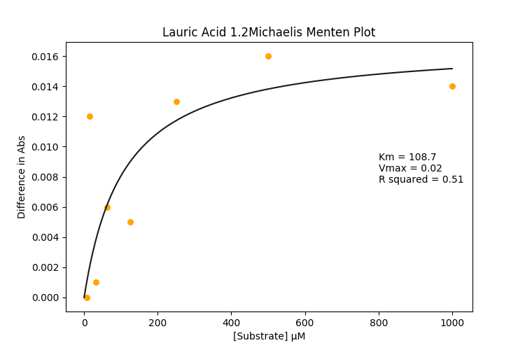|
||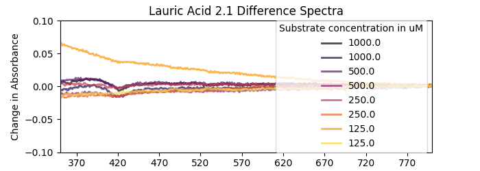|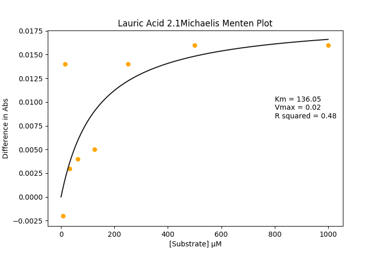|
||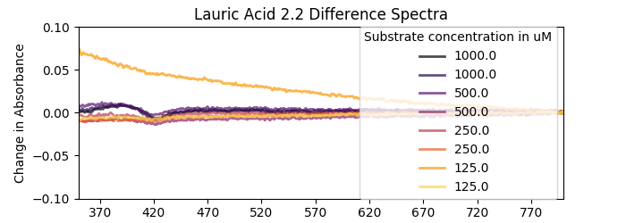||
||||
||||
||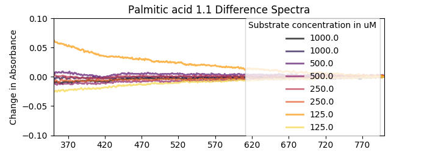|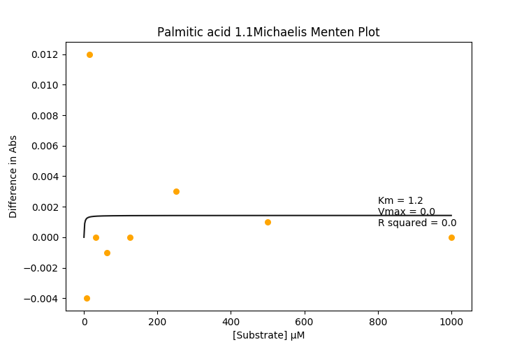|
|||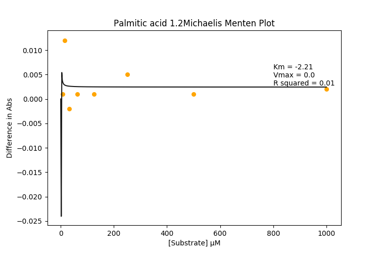|
||||
||||
||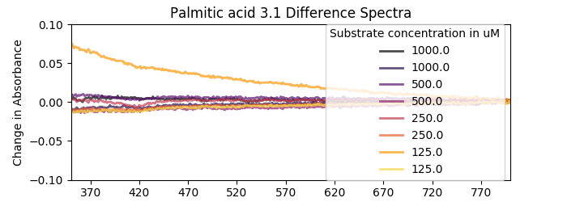||
||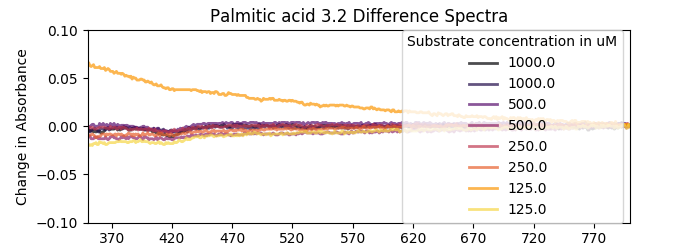|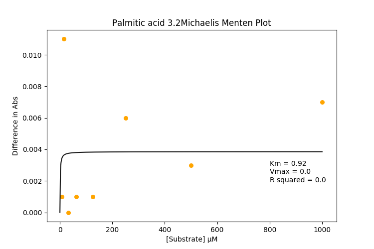|

And then I decided to do the whole thing again with a non-treated plate. I'll get the specs later. I ended up doing a couple of time points because I forgot to mix the plate and I wanted to see if I could let diffusion do the work and save some pipette tips.

Here are the three time points (hour apart)
* [one](20190625_regularplate_boi.CSV)
* [two](20190625_regularplate_boi2.CSV)
* [three](20190625_regularplate_boi3.CSV)

Smoked a lot of cigs whilst I was waiting. Should stop.

|Raw spectra|Difference Spectra|Michaelis Menten Plot|
|------------|-------------|----------|
||||
||||
||||
||||
||||
||||
||||
||||
||||
||||
||||
||||
||||
||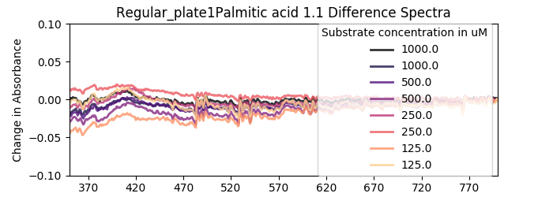||
||||
||||
||||
|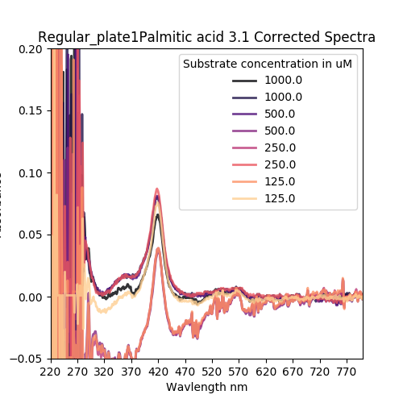|||
||||

|Raw spectra|Difference Spectra|Michaelis Menten Plot|
|------------|-------------|----------|
||||
||||
||||
||||
||||
||||
||||
||||
||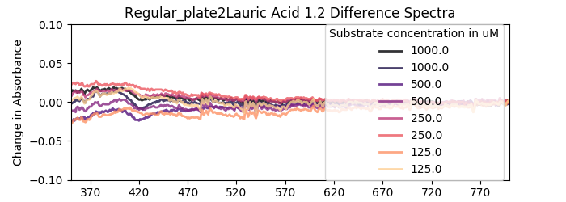||
||||
||||
||||
||||
||||
||||
||||
||||
||||
|||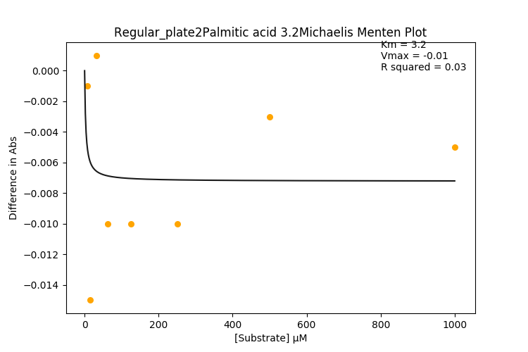|

|Raw spectra|Difference Spectra|Michaelis Menten Plot|
|------------|-------------|----------|
||||
||||
||||
||||
||||
||||
||||
||||
||||
||||
||||
|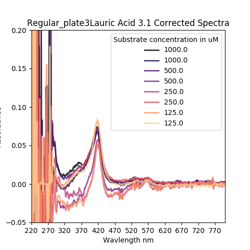|||
||||
||||
|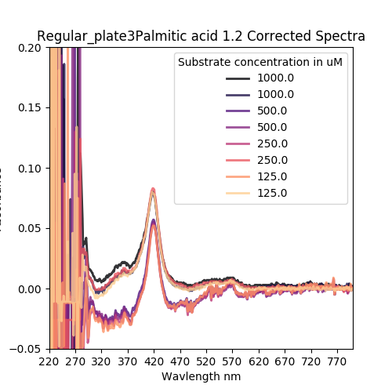|||
||||
||||
||||
||||
