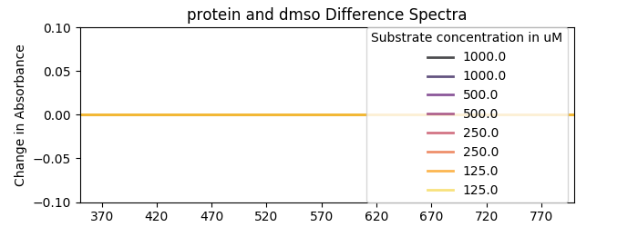
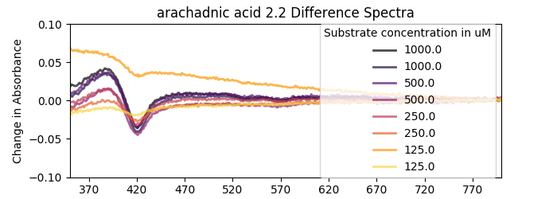
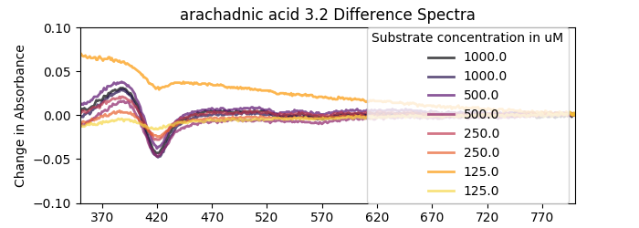
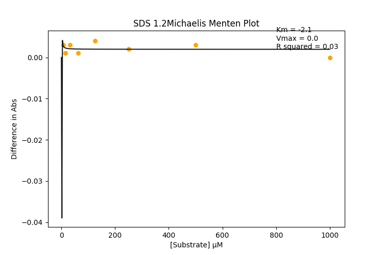
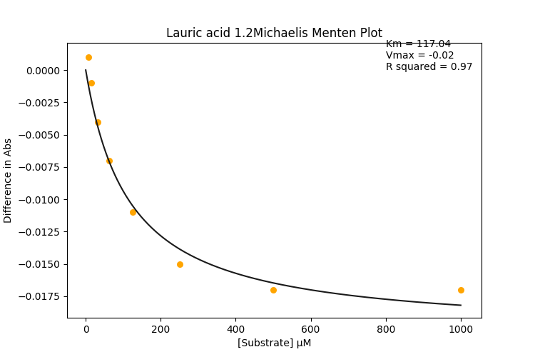
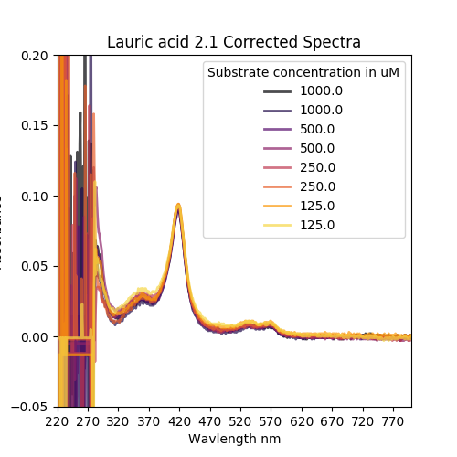
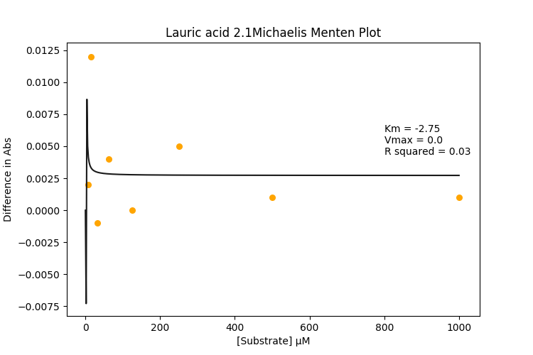
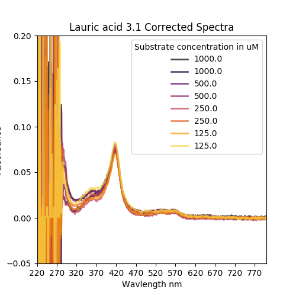

#### More

Re-weighing Lauric acid and Palmitic acid stocks

```python
>>> 256.42*0.01*0.001 #Palmitic acid mw * 10 mM * 1 ml
0.0025642
>>> 0.0025642 *1000 # mg
2.5642
>>> 200.32*0.01*0.001*1000 #Lauruc  acid mw * 10 mM * 1 ml * mg
2.0032
>>> 24.38/2.56 # Target weight / acutal (palmitic)
9.5234375
>>> 57.4/2.00 # Target weight / acutal (lauruc)
28.7
>>> 2870/2 # Lauruc acid fo 200 mM in less than 1.5 ml
1435
```

|Compound|Target Conc|Target Vol|Target Weight/mg|Actual Weight/mg|Vol DMSO for 10 /ml|
|-------|-----------|---------|--------------|------------|------------------|
|Palmitic acid|10 mM| 1 ml| 2.56|24.38|9.52|
|Lauric Acid|10 mM| 1 ml| 2.00|57.4|28.7|

The vials are 1.5 ml so I'm doing 100 mM then serial dilution.

|Compound| Target Conc| Vol DMSO/ul|
|------|---------------|------------|
|Palmitic acid|100 mM|952|
|Lauric Acid|200 mM|1435|

Palmitic acid hasn't been dissolving, so for this assay I'm just going to use SDS in its place:


Did the usual, didn't notice any mistakes but we'll see.
Here's the concentration check [data](20190622_BM3conccheck.csv) and here's the [script](ProtinConcCheck.py)

```python
$ python3 ProtinConcCheck.py
0    0.001906
1    3.807105
Name: P450 conc/uM, dtype: float64
```

cool.

|Corrected Specs| Difference Specs| Michaelis Menten Curves|
|---------|---------|---------|
||||
||||
||||
||||
||||
||||
||||
||||
||||
||||
||||
||||
||||
||||
||||
||||
||||
||||
||||


FFS what have I done 
