## 8 - Still at it

Last night I taxed an untreated Corning clear bottom 384 well plate to run the assay, just to see if I could get away with switching to the cheaper plates. The results were pretty messy, it's unclear if I just screwed up my pipetting. The way to test this that I can think of are:
* Do lots of reapeats
* Control the pipetting technique with a fluid handling robot

I'd prefer to do the latter, this way I can test all of my plates. I'll talk to Mark Dunstan about it at some point.

It looks like the most troublesome compounds are the ones that don't induce a very big spin shift. Sensitivity issue? You bet. Solution is mmo' protein, and therefore mo' signal? Maybe, I'll give it a shot. I should probably use the usual suspects:
* Arachadonic acid
* Lauric acid
* Palmitic acid
* 4-Phenlyimidazole

I don't think I need to do these repeats on the master plate any more, I think my pipetting there is fine. I'm going to find some deep well plates that will serve me well, where the pipette tips can actually reach the bottom. My go-to protein concentration is about 3-5 uM, so I'll repeat plates with different concentrations. I'll go low and high and aim for:
* 3-5 uM
* 10 uM
* 20 uM

Or there abouts. Maybe when I analyse it I won't just eyeball it this tiime! Here are some metrics that I an think of for comparison:
* R^2 - I guess I want to make my assays reflect he theooretical ideal?
* Deviation from expected Kds
* Variability within plates

I should defrost some fresh protein and spin it up.

Conc from [UV-vis](20190626_BM3conccheck.csv) at 5 in 1000 dilution:
```python
python3 ProtinConcCheck.py
0   -0.017053
1    3.892163
Name: P450 conc/uM, dtype: float64

>>> 5/1000.
0.005
>>> 3.892163/0.005
778.4326
```
Stock conc = 778.4326 uM
Vol of protein for each plate (half the wells used):
```python
>>> 384/2
192
>>> 192*25
4800
```
plus some safety margin I'll do 7000 ul per plate screw it. Here's my math:

```ipython
In [1]: def vol_to_use(c1,c2,v2):\
   ...:     return (c2*v2)/c1

In [2]: vol_to_use(778.4326 ,5,7000)
Out[2]: 44.96214572719591

In [3]: vol_to_use(778.4326 ,10,7000)
Out[3]: 89.92429145439182

In [4]: vol_to_use(778.4326 ,20,7000)
Out[4]: 179.84858290878364
```

Did a [trace](20190626_BM3conccheck2.csv), it went outside of the typical Sensitivity band but I wanted to recover the stocks.

!!!!!! Just realised I used the wrong path in my last conc check! Here's the good good:
```python
python3 ProtinConcCheck.py
0   -0.015248
1    7.551550
Name: P450 conc/uM, dtype: float64
```

But I already did some dilutions, here's their calculated concentrations:
```python
python3 ProtinConcCheck.py
0    -0.015248
# trace from above (added to same method)1     7.551550
2     7.097198
3    14.096625
4    27.565280
Name: P450 conc/uM, dtype: float64
```
I think this is still workable so I'm going ahead.
what vol of stocks do I need?
```python
>>> 384*3/2*25/8 # 3 plates, half the wells, 25 ul in each well, 8 different concs
1800
```
Platelayouts:


I might have done some of the pipeting wrong, I was using the electronic pipette for the first time on this one, which made the operation really fast, but I had bubble trouble. I span the plates down at 3700 rpm for 2 mins to get rid of plate bubbles then ran the plates on the PherastarFS wih 30 seconds of orbital mixing before the start because I didn't do any pipette mixing.

|Plate name|Protein conc|data|
|-------|---------------|-----|
|Plate1|7.09 uM|[data](20190626_plate1.CSV)|
|Plate2|14.09 uM|[data](20190626_plate2.CSV)|
|Plate2|27.56 uM|[data](20190626_plate3.CSV)|


### Plate 1
* Signal's good, but somethings messed up

|Corrected Spectra|Difference Spectra|Michaelis Menten Plot|
|----------|------------|-------------|
||||
||||
||||
|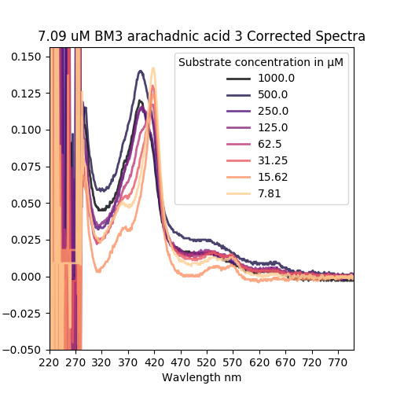|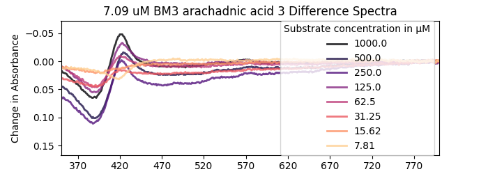||
||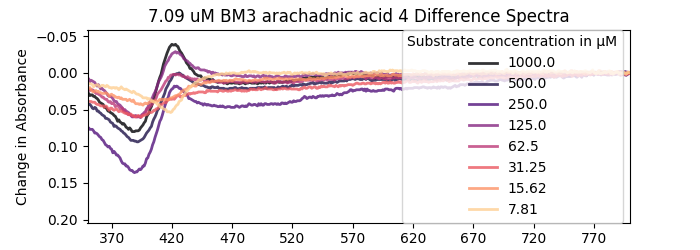||
||||
|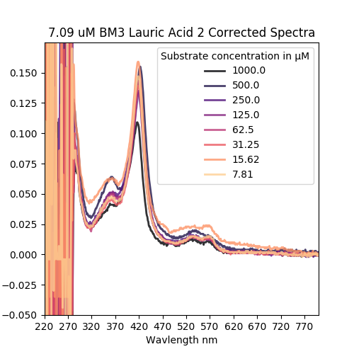|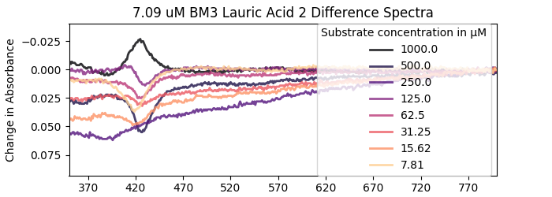||
||||
||||
||||
||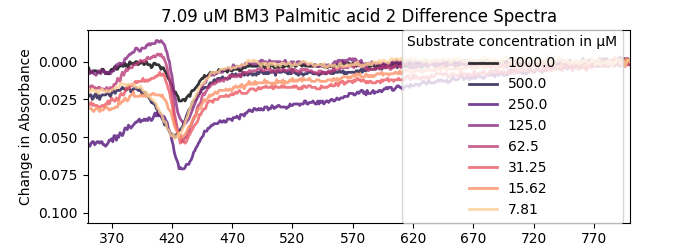||
|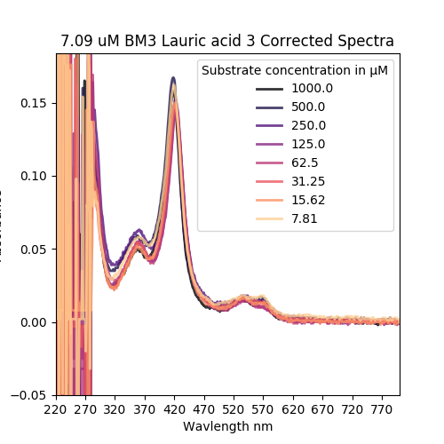|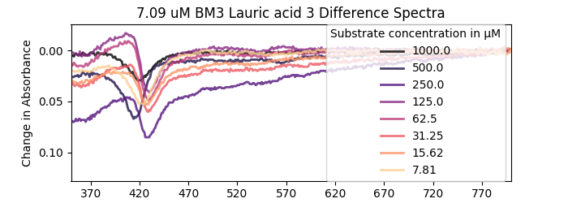||
||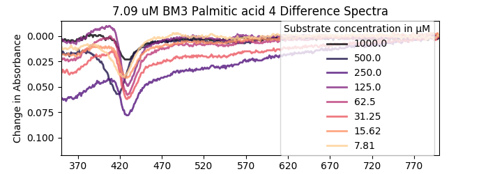||
||||
||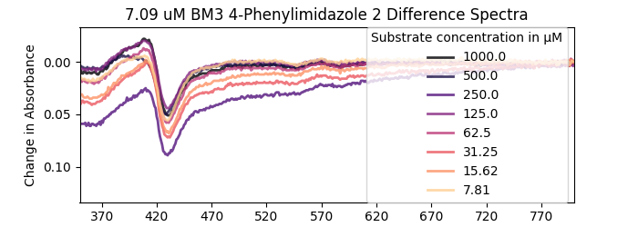||
|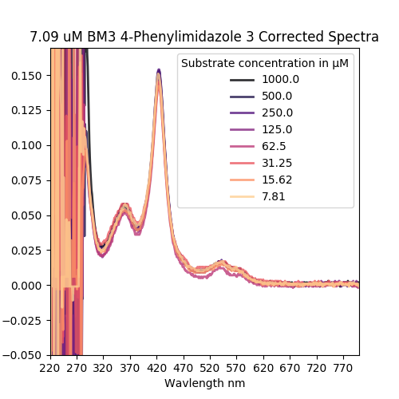|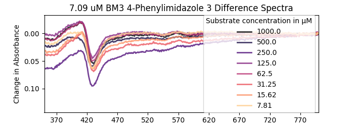||
|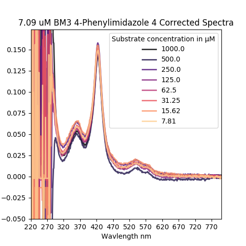|||


### Plate 2

|Corrected Spectra|Difference Spectra|Michaelis Menten Plot|
|----------|------------|-------------|
||||
||||
|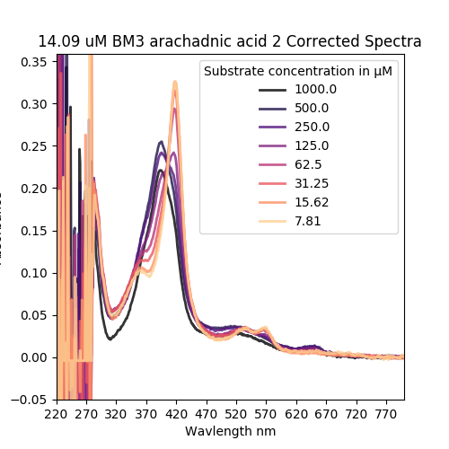|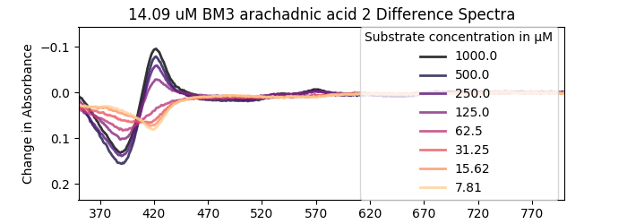||
||||
||||
||||
||||
||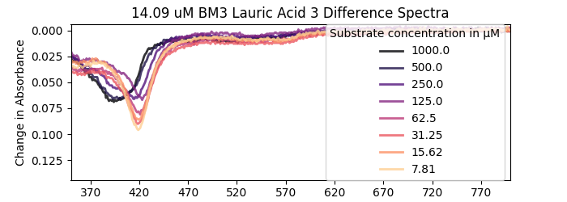||
|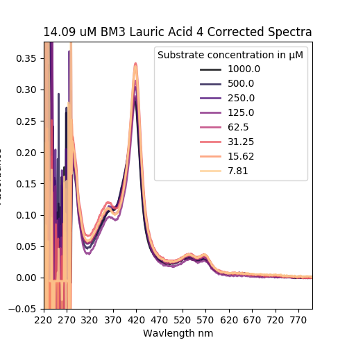|||
||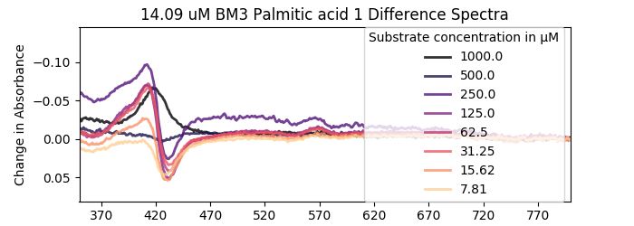||
|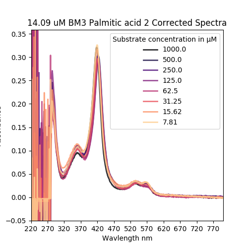|||
|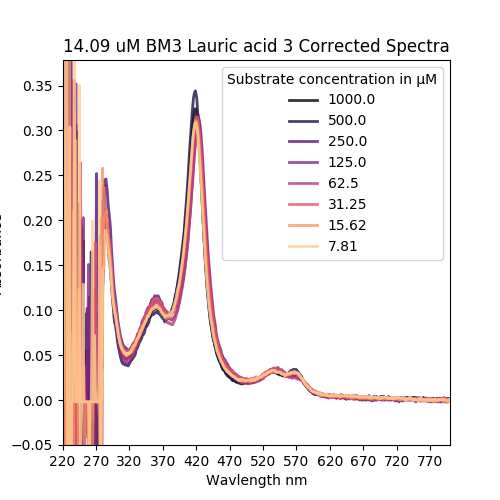|||
|||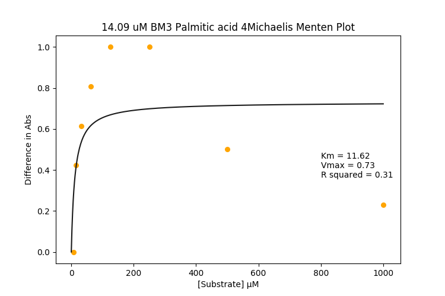|
||||
||||
|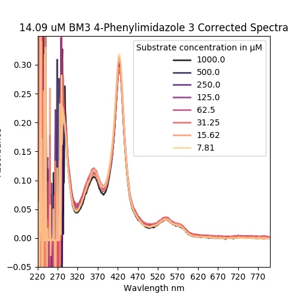|||
||||


### Plate 3

|Corrected Spectra|Difference Spectra|Michaelis Menten Plot|
|----------|------------|-------------|
||||
||||
||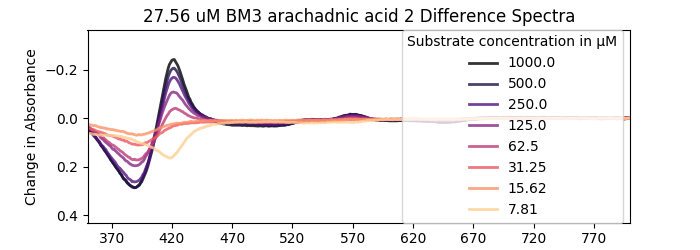||
||||
||||
||||
||||
||||
||||
||||
||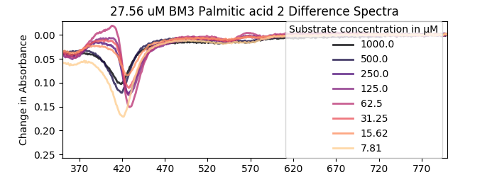||
|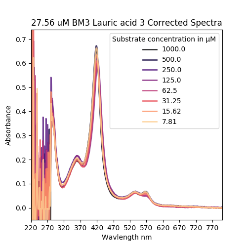||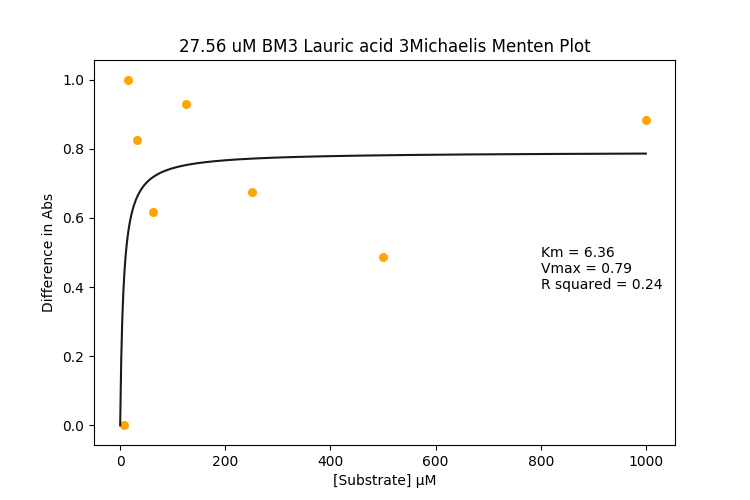|
||||
||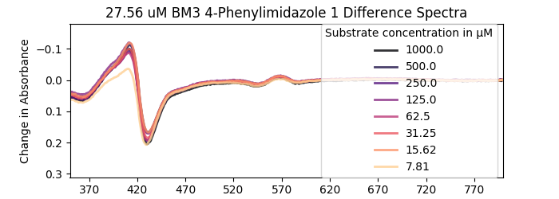||
|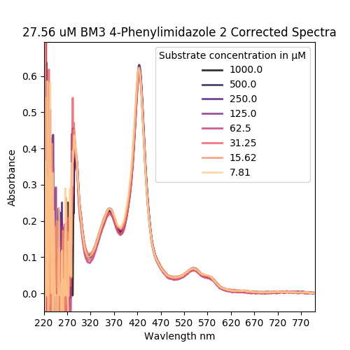|||
||||
||||


It looks like there's a problem with my Michaelis Menten script, I'll try to resolve that soon.
###### Later that day
I've been cleaning up my analysis script becuase it was messy and needed doing. Here's a [cleaner version](PlateAnalysis_Cleaner.py). I think I solved the Michaelis Menten stuff by minmax scaling my data between 0 and 1, which gets rid of those weird T-Shaped curves. I also set bounds for vmax and km (both positive), and played with the idea of setting the minumum vmax to 1, seeing as if the data is ideal, vmax should always be greater than 1, but then realised that my data isn't ideal so I scrapped that idea.

I used [this version of my plate analysis script](PlateAnalysis_Cleaner_exceptForMakingThatMetricsTable.py) to make a [csv](201990626_BM3Concs_MetricsAndStuff.csv) of all the metrics for each test run (km, vmax and R²). I made [another script](20190701_iteration_8_analysis.py) to plot up this bis and remove some crazy outliers.

|My plot with a sexy heatmap||
|------|-----------|
||Looks like a weak signal means poor curve fitting, who would have known. I'm ignooring the Km here because it depends on the R^2, but then again so does vmax.|
||Protein concentration probably isn't the issue here is it?|

### Wrap up
* I can probably get away with using a mid-low concentration of protein. At this point it's hard to tell the effect that protein conc has on signal strength.
* Substrates with a low vmax tend to have non-ideal results (low R²). I should quantify this and maybe see if I can tweak it
* Pipeting errors are still my biggest problem. Need to get better and also coordinate with Mark D for getting a robot program ready
