### More

Doing a test where I don't fuck up the pipetting. I'll use:

*  Arachadonic acid
* Lauric acid
* Palmitic acid :angry:
* 4-Phenylimidazole

And then I'll have to do some titrations  and compare how well the assay performs in relation to their vmax.

#### Calc

* I'll do 5 repeats of each, why not
* Total compound needed:
```python
>>> 8*5*25
1000
```
plus some

* How much protein will I need?

```python
>>> 21*8*25
4200
```

Last time, I measured The [protein conc](/8_MoIterations/20190626_BM3conccheck.csv)
```python
python3 ProtinConcCheck.py
0   -0.017053
1    3.892163
Name: P450 conc/uM, dtype: float64
```

```python
>>> 5/1000.
0.005
>>> 3.892163/0.005
778.4326
```
So the stock conc is 778.4326 µM ish

```python
>>> def vol_to_use(c1,c2,v2):\
...     return (c2*v2)/c1
...
>>> vol_to_use(778,10,5000)
64
>>> vol_to_use(778,10,5000.)
64.26735218508998
```
64 ul in 5 ml of buffer, I took a [trace](2019071_BM3conccheck.csv) and ran my [script](ProtinConcCheck.py) to check concs

```python
python3 ProtinConcCheck.py
0    -0.000926
1    15.142500
Name: P450 conc/uM, dtype: float64
```
15 µM sounds good.
Going to make my chemical stocks now, I decided on 1200 µl for some dead volume. 8% v/v of stock
```python
>>> 1200.*0.08
96.0
```
But then I messed up a bunch of times and then decided to just get out a 96 well PCR plate and do 2 repeats of each chem. Didn't feel like I messed up the pipetting, but that electronic pipette I've been using is a nightmare, it double dispenses or something at the end of the MD setting. I think that's what messed me up so much last time. It also sucks up loads of bubbles and I don't know how to control the speed.
Here's the layout I ended up doing:

Except I forgot to scan the last column.

Read the plate, here's the [data](20190701.CSV)


|Raw Specs|Difference Specs|Michaelis Menten|
|------------|--------------|------------|
|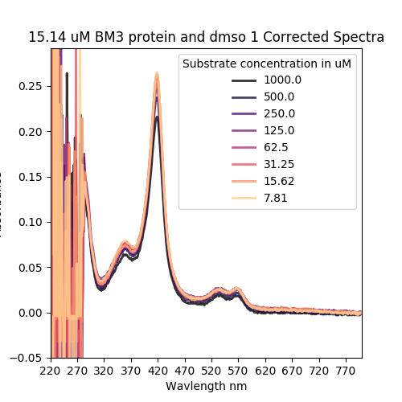|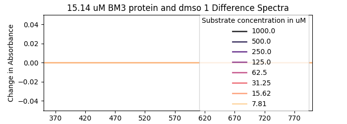|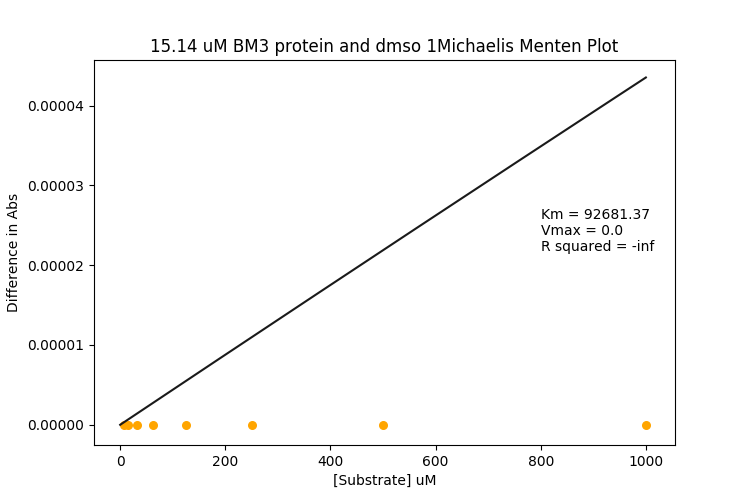|
|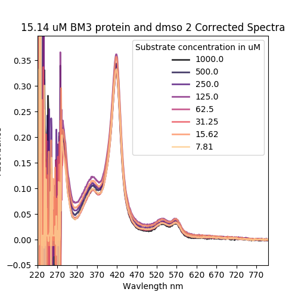|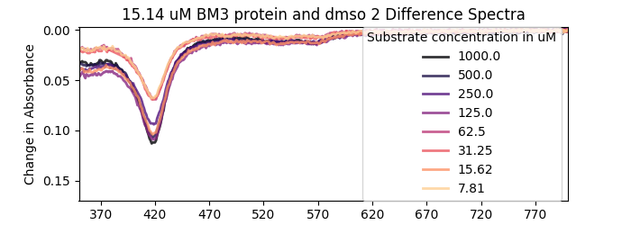|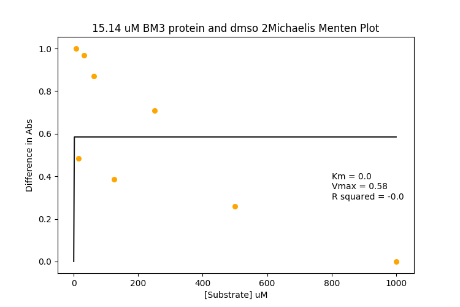|
|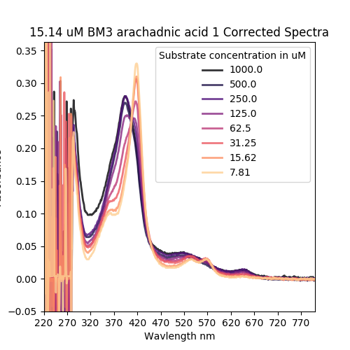|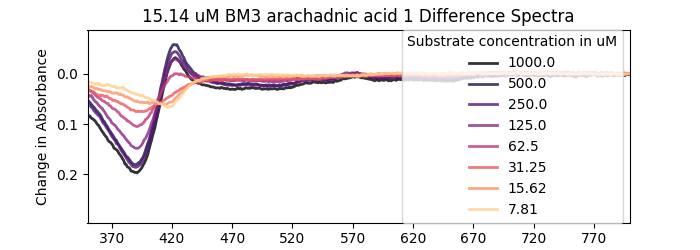|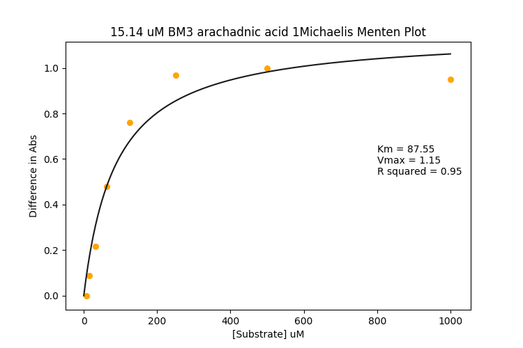|
|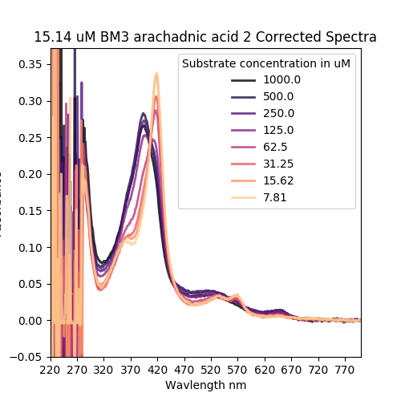|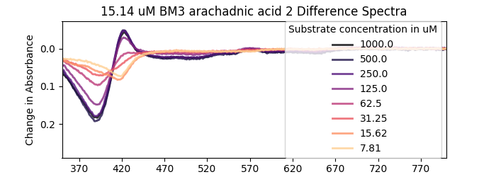|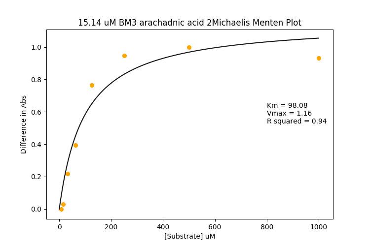|
|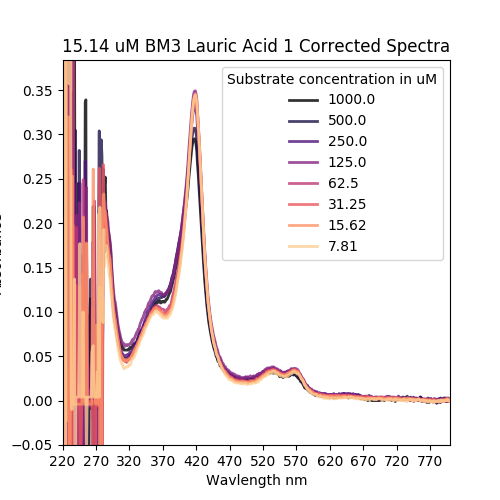|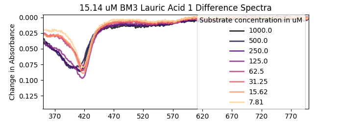||
|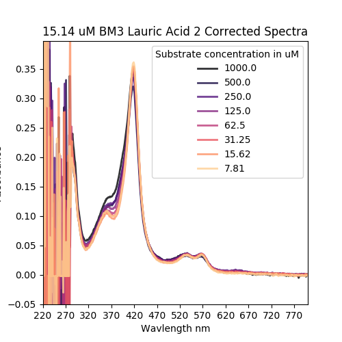|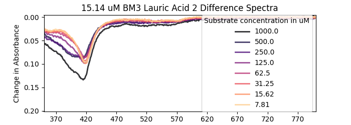|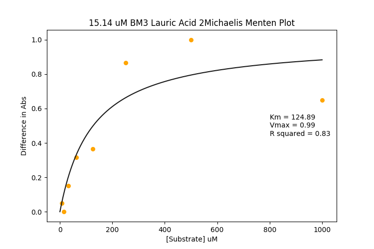|
||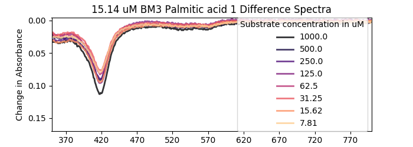|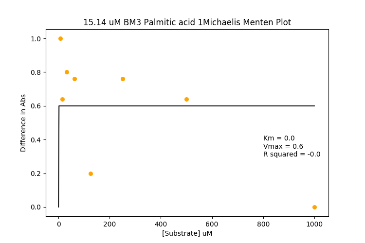|
|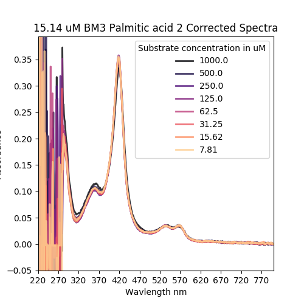|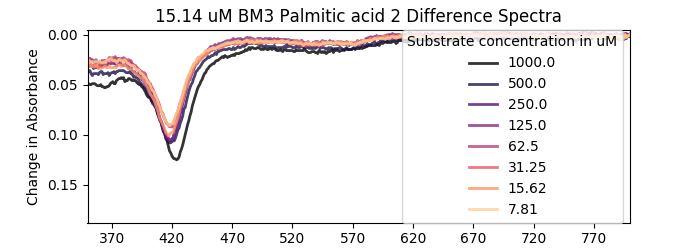|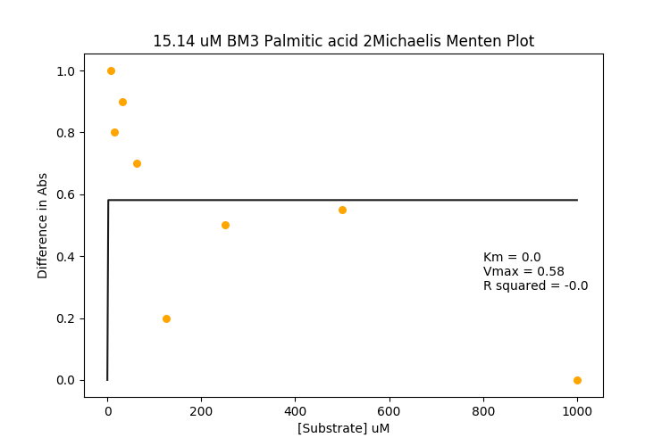|
|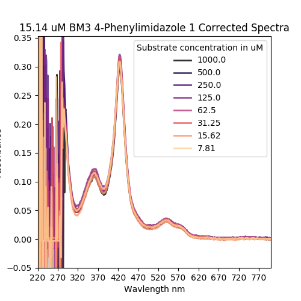|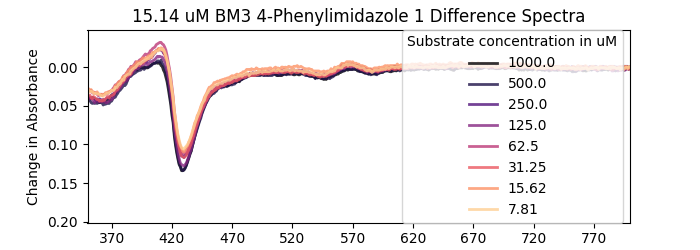|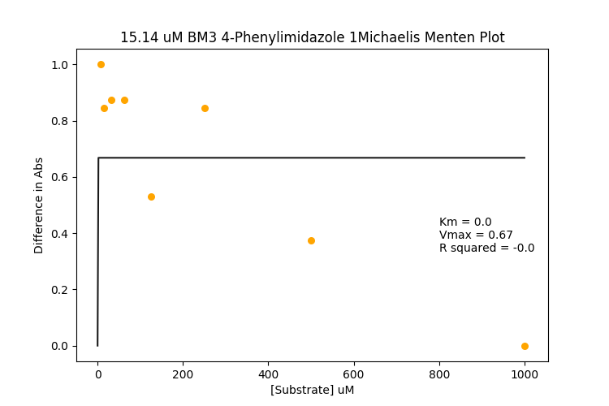|


I hate palmitic acid. It sort of looks like the DMSO trace (the second one) I probably only realised this now because I don't normmally do repeats of the protein DMSO traces. So far I don't actually have anything to catch non-substrates and anomalies, should probably work on that. Maybe I should do lots of DMSO repeats and see what the deal is??? Or maybe check my existing data, that makes more sense.
