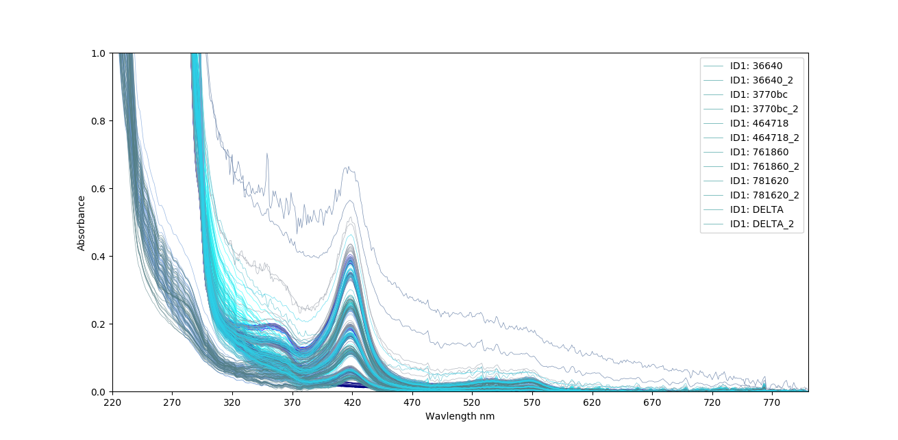
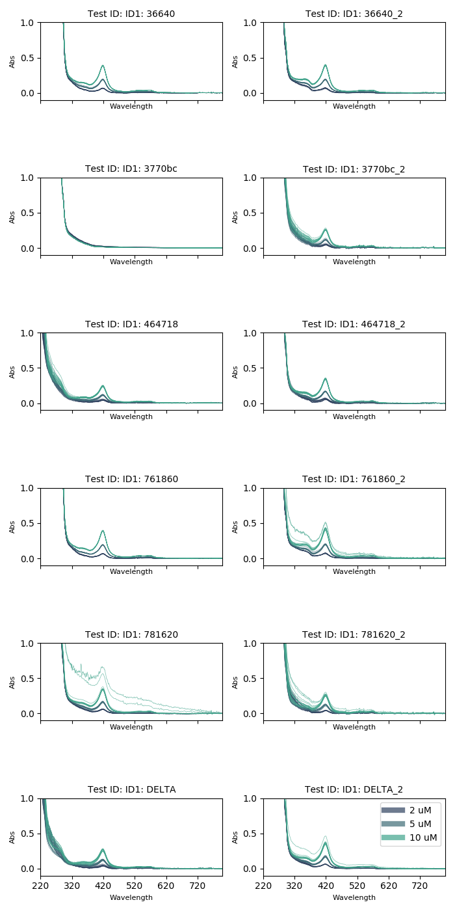

# Aim
Previously we saw some light scattering in the plate that may obscure the measurements. The scattering correlated with the volume of 
protein used in the wells (after path length was corrected for) which suggests that thte protein is interacting with the plate
material.

This test is designed to find a plate type that mitigates the scattering effect. I have plate samples from several vendors in [this csv](Inventory.csv)
Down the line, I'll have a tinker with buffer conditions, but surfactants are out because P450 BM3 mutants are known to interact
with these which will give false positives.

|Make|Plate type| Product Number|Qty |
|:---:|:--------:|:-------------:|:---:|
|Thermo|Nunclon Delta Surface|? |20 |
|Brand|?|781620|2| 
|Brand|Lipograde| 781860|4| 
|Nunc| Maxisorp| 464718|1| 
|Corning| Cellbind| 3770BC| 17|
|Corning| Cellbind| 3640|14| 

# Plan
I'm going to use each of the plate types in my [inventory](Inventory.csv) for this one. My last assay isn't written onto Github
yet but will do soon. 
* Measure the scattering of wild type P450 BM3 heme domain with no substrate 
* Scattering measured by using a derivation of the Rayleigh light scattering equation
* Measurements will be UV-Vis traces taken between 200 and 800 nm
* I'm going to fix the volume at 50 uM, becuase I'm feeling like for the final assay, maybe I want to be diluting and dispensing my compounds by serial dilution, in which case I think a bigger volume is a bit better?
* I might try a couple of different protein contentrations. Will measure the final dilutions on a regular UV-Vis.

So I have 6 different plate types, and say for each concentrations I want to do enough repeats to fill a row. That's 16 wells of 50 ul which is 800 ul total per row, per plate. x6 plates = 4.8 ml + some dead volume for if I dispense with the multidrop.
The concentration range I was working in before was 2-10 uM, so maybe I'll do 2, 5 and 10 today.

# Lab Notes
Made fresh stocks of assay buffer 1
|Buffer1|100 mM KPi|pH 7|
Defrosted BM3 wild Type
### Concentration Check
```python
>>> A420 = 0.4671191573
>>> dil = 5./1000.
>>> ext = 95
>>> (A420/dil)/ext
0.9834087522105261
```
conc = 0.983408 mM

#### Dilutions
4.8 mls per concentration + spare and dead volume. I'll do 10 mls.
I'm trying to hit 2, 5 and 10 uM
Here's my working in uM and uL:

```python
>>> (10000*10)/983.4087522105264 # 10 uM
101.6871161408905
>>> (10000*5)/983.4087522105264 # 5 uM
50.84355807044525
>>> (10000*2)/983.4087522105264 # 2 uM
20.3374232281781
```

1. I made up 10 mls of buffer containing the dilutions calculated above
2. Then checked their absorbance on the UV-Vis box and saved the data [here](PlateSelection/20190603_BM3PostdilutionConcCheck.csv)
3. Dispensed row 1 of each plate with 2 uM protein row 2 5uM and row 3 10 uM
4. Measured absorbace from 220:800 nm on a BMG Pherastar FS
5. Spun plates at 3,000 rpm for 3 mins (to remove bubbles)
6. Re-did the absorbance measurements, adding ```_2``` as a suffix

I just plotted everything using [this script I wrote](PlateSelection/20190603_PlateSelectionAnalysis_JustPlotEverything.py). It's nice to see that some plates aren't like the others!


Looks like I chose a lot of very similar colors, which isn't very insightful. I'll do something more numeric in a bit.

## Analysis
#### Aim:
I'm looking for the effect of plate type on scattering. I also scanned the plates before and after spinning them which might have an effect. I also varied protein concentration, so that's:
* 6 plate type
* 3 protein concentrations
* Before and after centrifugation
All in 16 replicates. Here's what I need to do:
1. Split the data into ets of repeats
2. Fit the scattering curve to it to get out my scattering metric
3. Look for correlations between my factors above and the scattering

#### Part 1 - Descriptive
Figured out how to use subplots and plotted all of the experiments using [this script](20190603_PlateSelectionAnalysis_subplotBrach.py), which should have some reusable bits in. If I was smart I'd make a standard set of really useful tools but whatever. 

||
|:-----------------:|
|*Figures* Hope that's in bold. The title indicate the product identfier, and the suffix ```_2``` indicates that the readings were taken after 3 minutes centrifugation at 3,000 rpm, which should remove bubbles.|

Looking at this, I can see that centrifugation appears to make a difference. When I was doing the readings I noticed more bubbles in the High protein conc wells, maybe it's a viscosity thing. These bubble might be a serious problem in terms of anomalies, so I'll be spinning all my plates from now on. Maybe for longer than 3 mins too. It looks like some plates are more anomaly-prone than others, so I'll look into that.

Interesting how the Centrifugation change the limit of this scattering function. Maybe bubbles play a big role. The 36640 plate (mis-type of 3640) is a non-treated plate so is pobably the cheapest of the bunch. It might be wise to work with this from now on, becuase it looks fine. The 3770bc test is strange, it looks like I put the plate in the wrong way around. If that's the case, then maybe the polystyrene itself is absorbing weird. I really should have done some blanks.

#### Discussion
* Decided not to try to fit a scattering curve to these traces becasue they all look like the follow similar curves. 
* Bubbles are an issue and from now on I will spin my plates for at least 3 mins at 3,000 rpm or as fast as I can.
* Maybe the 'scattering' isn't actually scattering but plate material absorbance. I'd know if I had bothered wih blanks. Will have to do those next time
* The plate typle doesn't seem to mak much of a diffrence, which is cool because I can use the cheapest ones (Corning 3640 polystyrene untreates) 🤙🤙
