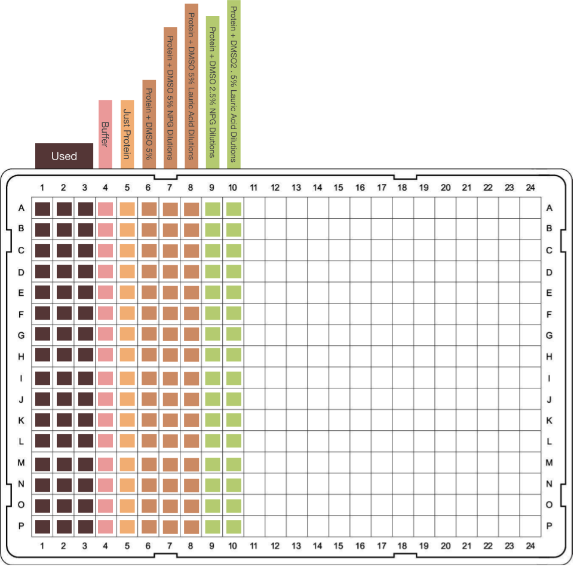
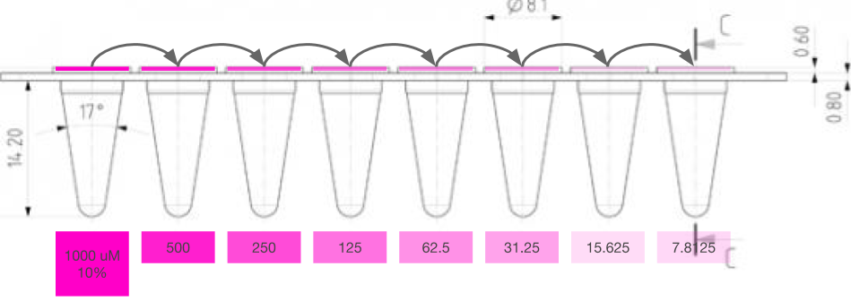
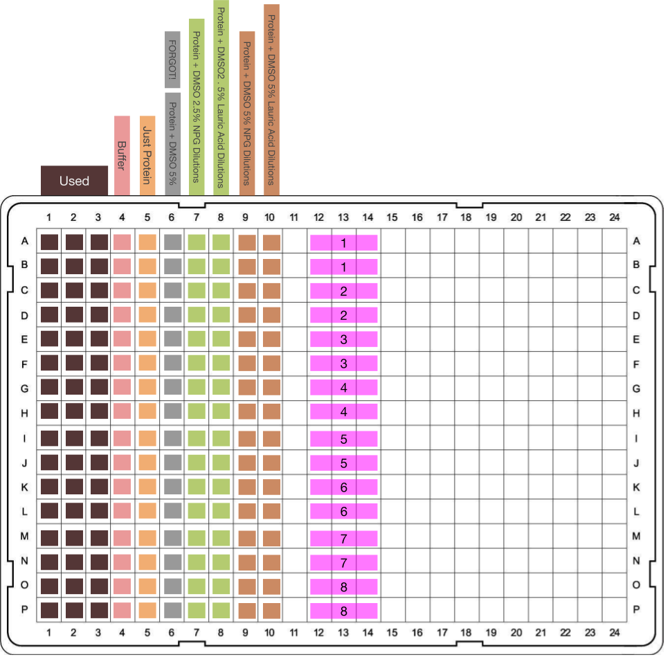

## Seial Dilution Scheme
### TL;DR
I want to dispense my compounds using serial dilutions because thy're easy. Here's how.

### Background
* The [last set of tests](P450_Assay_Development/PlateSelection/) showed that plate type probably doesn't matter, they all looked similar
* The plastic of the plate might be absorbing some of the short wave light, I'll try to confirm that in this test
* In the 2018 tests, I had trouble mixing fatty acids dispensed by Echo with the assay mix, I think I'll have more luck with a serial dilution

### Plan
Here's what I want to keep fixed and why:
* ```[Protein]``` at 10 uM - Gives a good signal to noise ratio, not far off what we'd use for a classical titration
* ```Conc of DMSO in each well```  - DMSO can interact with P450 BM3, so I need to control this variable 
* ```Well Volume``` 50 uM - suggested working volume for plates, seems like it gives a good signal
* ```Number of substrate concentrations``` 7 seems fine

Here's what I'll vary:
* ```Substrate``` - I'm trying Lauric Acid + N-Palmitoglycine
* ```[Substrate]``` - working range shouldn't exceed 10 mM in DMSO and 5% v/v DMSO in final mix (because vendors sell compounds in 10 mM DMSO and because 5% DMSO is about the limit of what BM3
* ```Time Points``` Just in case this thing is time sensitive, I really should know

Plate layout:




Looks cool. I think I'll do my serial Dilution in a PCR 8 strip and do  repeats of each conc, which will fill a column. 

#### Serial dilution scheme
For this test I want to keep my DMSO conc constant. For now I'll do the easy sounding option which is equal vols of double concentrate protein and substrate, each in the same buuffer. That means my starting protein stock has to be 20 uM.

I'm doing two stocks of each substrate - one where the final DMSO conc is 5%, and the other 2.5%. The DMSO stock of compound has to be 10 mM because that's what vendors sell the compounds as. So for each compound I'll do a 5 and 10% v/v 10 mM Compound in DMSO, in assay buffer. That means that the working range of compound conc is 0-500 uM for the 5%ers and 0-250 uM for the 2.5%.

Here's what the master stocks will look like for the 5% mixes:



These will get diluted by half again in the plate with the stock. The 2.5% ones are the same sort of thing, just half concs.

#### Lab Notes 
##### 6th June
Diluted the protein stock (BM3 WT heme, same as in [plate selection](P450_Assay_Development/PlateSelection) from yesterday).

```python
>>> conc = 983.4087522105264
>>> 6*16*25 # 6 rows times 16 cells per row times 25 uL of protein stock per well
2400
>>> 2400*1.5 # Times a safety margin
3600.0 
>>> 3600.0*20 # 20 uM protein
72000.0
>>> 72000.0/conc
73.21472362144117
```
I measured the absorbance of this thing on a spec here
...

I diluted the compounds from old 10 mM stocks in DMSO. Might do it properly next time. 
Here's everything in mM 🖕
| ID | 1 | 2 | 3 | 4 | 5 | 6 | 7 | 8 |
| ---|---|---|---|---|---|---|---|---|
|NPG 5%|0.5|0.25|0.125|0.0625|0.03125|0.015625|0.0078125|0.00390625|
|Lauric 5%|0.5|0.25|0.125|0.0625|0.03125|0.015625|0.0078125|0.00390625|
|NPG 10%|1|0.5|0.25|0.125|0.0625|0.03125|0.015625|0.0078125|
|Lauric 10%|1|0.5|0.25|0.125|0.0625|0.03125|0.015625|0.0078125|

I multichannel pipetted 25 uL of each of these into the 384 well plate (Corning 3640) annd made up the remaining 25 uL with my protein. I'll do a conc table later maybe. I span it all at 3700 rpm for 3 minutes then scanned it on the PheraSTAR fs on a 220-800 nm sweep of the wells. The layout looked like this in the end btw:


